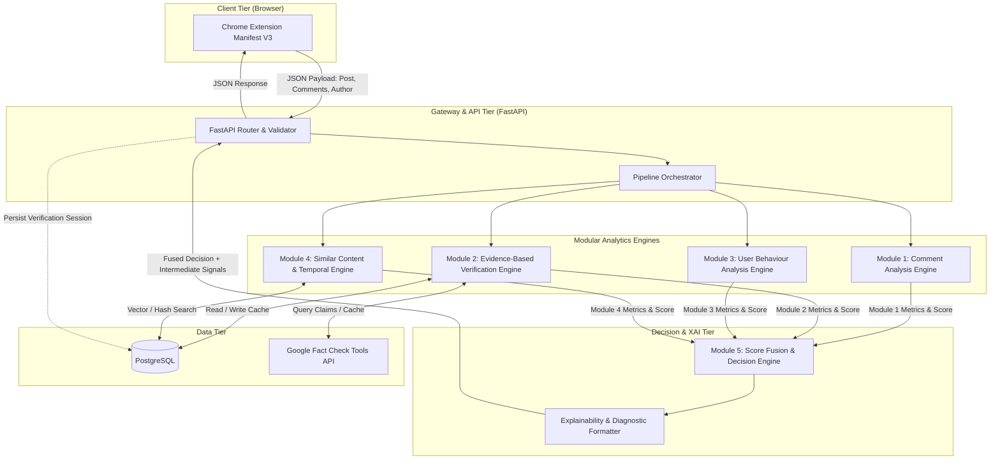
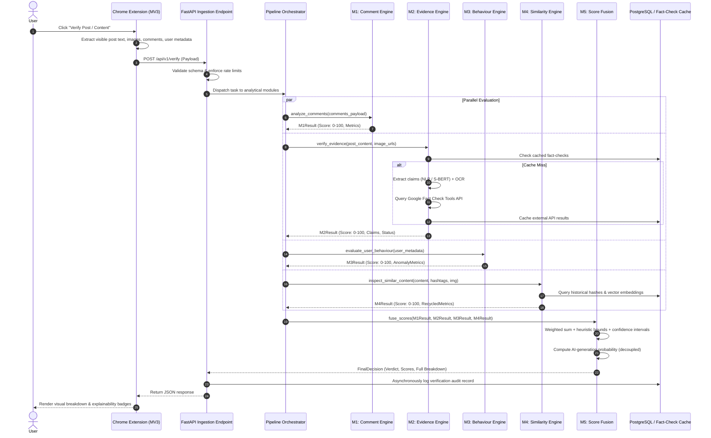
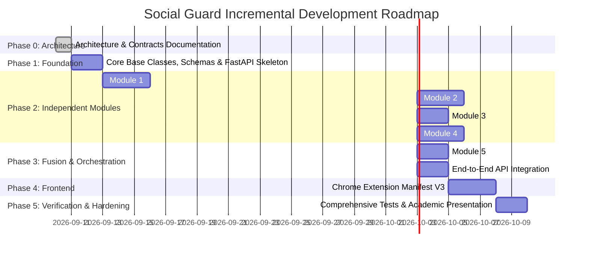

# System Architecture: Social Guard
**An Explainable AI Framework for Social Media Content Verification**

---

## 1. Executive Summary & Objective

**Social Guard** is a multi-modal, explainable AI (XAI) framework engineered to assess social media content credibility and detect coordinated manipulation or synthetic generation. Rather than relying on a single opaque black-box classifier, Social Guard computes verifiable, interpretable metrics across **four independent analytical vectors** and fuses them into an explainable multi-tier decision matrix.

### Core Distinctions
- **Factual Credibility vs. Synthetic Generation**: AI-generated text is not inherently false, and human-written text is not inherently true. The framework treats **Credibility Score** (factual veracity & social authenticity) and **AI-Generated Probability** as orthogonal, decoupled outputs.
- **Explainability**: Every module yields normalized numerical scores (0–100) alongside granular intermediate metrics (e.g., semantic similarity graphs, anomaly indicators, fact-check ratings, perceptual hash distances) to furnish human-understandable audit trails.

---

## 2. High-Level System Architecture

The system follows a decoupled, service-oriented modular architecture comprising:
1. **Client Tier**: Chrome Extension (Manifest V3) capturing publicly visible DOM data upon user request.
2. **Gateway / API Tier**: FastAPI asynchronous application handling ingestion, rate limiting, request validation, orchestration, and persistence.
3. **Analytics Tier**: 4 Independent Processing Engines + 1 Fusion & Decision Engine.
4. **Data Tier**: PostgreSQL (storing verification history, cached fact-checks, perceptual hashes, and user audit logs).



---

## 3. Detailed Data Flow



---

## 4. Module Responsibilities & Analytical Boundaries

### Module 1: Comment Analysis Engine (`social_guard.modules.comments`)
- **Core Purpose**: Detect bot amplification, astroturfing, coordinated copy-paste campaigns, emotional manipulation, and abnormal temporal spikes in engagement.
- **Input**: List of comment objects `[{author_id, text, timestamp, likes_count, ...}]`.
- **Techniques & Algorithms**:
  - **Text Preprocessing**: Normalization, tokenization, stopword filtering, emoji extraction.
  - **Semantic Similarity**: Sentence-BERT (`all-MiniLM-L6-v2`) embeddings + pairwise Cosine Similarity matrix to detect paraphrased bot farms.
  - **Duplicate / Template Detection**: Exact string hashing & Levenshtein distance ratio.
  - **Emoji Distribution Analysis**: Shannon entropy over emoji distributions; sentiment discordance detection.
  - **Temporal & Activity Burst Detection**: Time-delta histogram binning; Z-score and Interquartile Range (IQR) on comment arrival rates to detect inorganic bursts.
- **Output Schema**:
  - `score` (float: 0–100): High score = authentic, organic, high-veracity sentiment; Low score = bot-manipulated/brigaded.
  - `intermediate_metrics`:
    - `duplicate_comment_ratio` (float)
    - `semantic_clustering_coefficient` (float)
    - `emoji_entropy` (float)
    - `burst_anomaly_zscore` (float)
    - `flagged_spikes` (list of time intervals)

---

### Module 2: Evidence-Based Verification Engine (`social_guard.modules.evidence`)
- **Core Purpose**: Extract verifiable factual claims from post text and image OCR, cross-reference against authoritative fact-checking registries, and evaluate source authority.
- **Input**: Post text, attached media/image URLs or buffers.
- **Techniques & Algorithms**:
  - **OCR Extraction**: Tesseract / OpenCV image preprocessing (thresholding, noise removal) for meme / image text.
  - **Claim Extraction & Filtering**: NLP pattern-matching and transformer-based Claim Detection to isolate verifiable statements from opinions.
  - **External Knowledge Verification**: Google Fact Check Tools API querying.
  - **Rating Normalization**: Standardized mapping of heterogeneous fact-checker verdicts (e.g., "Pants on Fire", "Mostly False", "Correct") to a continuous scale $[0.0, 1.0]$.
  - **Source Credibility Weighting**: Domain authority scoring for fact-checking publishers (e.g., Snopes, Reuters Fact Check, AP Fact Check).
- **Possible States**:
  - `SUPPORTED`: Validated by reputable fact checks.
  - `CONTRADICTED`: Explicitly debunked by reputable fact checks.
  - `NO_FACT_CHECK_FOUND`: Neutral state; no verified claims present.
  - `INSUFFICIENT_EVIDENCE`: Fact check exists but claim context differs or confidence is low.
- **Strict Constraint**: `NO_FACT_CHECK_FOUND` must **NEVER** default to true or false. It assigns a neutral fallback baseline with adjusted confidence bounds.
- **Output Schema**:
  - `score` (float: 0–100)
  - `state` (Enum: `SUPPORTED`, `CONTRADICTED`, `NO_FACT_CHECK_FOUND`, `INSUFFICIENT_EVIDENCE`)
  - `intermediate_metrics`:
    - `extracted_claims` (list of strings)
    - `matched_fact_checks` (list of `{claim, claimant, publisher, rating, url, raw_rating}`)
    - `source_credibility_score` (float)
    - `ocr_text` (str)

---

### Module 3: User Behaviour Analysis Engine (`social_guard.modules.user_behaviour`)
- **Core Purpose**: Quantify account trustworthiness and detect automated or deceptive account behavior using strictly public profile markers.
- **Input**: Public profile metadata `{account_age_days, followers_count, following_count, post_frequency_daily, recent_posts, ...}`.
- **Techniques & Algorithms**:
  - **Feature Engineering**:
    - Follower-to-Following Ratio ($FFR$).
    - Account Longevity vs. Activity Volume ($Posts / Day$).
    - Average Posting Time Delta & Standard Deviation.
    - Engagement Rate ($(\text{Likes} + \text{Shares}) / \text{Followers}$).
    - Hashtag Density & Content Repetition Ratio across recent timeline.
  - **Anomaly Detection**:
    - Isolation Forest trained on baseline legitimate user distribution datasets.
    - Statistical Outlier Detection via Z-score and IQR for posting velocity.
  - **Rule-Based Behavioral Guardrails**: Penalty weights for brand new accounts (< 7 days) displaying extreme post velocities.
- **Strict Constraint**: Anomalous behavior (e.g., a rapid news aggregator bot or high-activity creator) does **NOT** automatically make the post fake; it only lowers the behavioral authenticity score.
- **Output Schema**:
  - `score` (float: 0–100)
  - `intermediate_metrics`:
    - `is_anomalous` (bool)
    - `isolation_forest_anomaly_score` (float)
    - `follower_ratio_score` (float)
    - `posting_frequency_zscore` (float)
    - `duplicate_history_ratio` (float)

---

### Module 4: Similar Content & Temporal Analysis Engine (`social_guard.modules.similarity`)
- **Core Purpose**: Detect recycled misinformation narratives, meme re-uploads, astroturfing across hashtags, and coordinated timeline propagation.
- **Input**: Post text, hashtags, visual media, creation timestamp.
- **Techniques & Algorithms**:
  - **Hashtag & Keyword Analysis**: Jaccard similarity and coordinated tag flooding detection.
  - **Text Semantic Similarity**: Sentence-BERT cosine similarity against a database of known debunked rumors and historical corpus.
  - **Image Perceptual Hashing**:
    - Average Hash (`aHash`), Difference Hash (`dHash`), Perceptual Hash (`pHash`) via `ImageHash`.
    - Hamming distance thresholding ($D_H \le 5$) for image reuse detection under resizing/compression.
    - Future extension hook: Vision-Language CLIP embeddings.
  - **Temporal Decay & Replay Detection**: Identifying old media (> 2 years old) being recirculated as current breaking news.
- **Output Schema**:
  - `score` (float: 0–100): High score = original context / organic; Low score = recycled viral narrative / out-of-context replay.
  - `intermediate_metrics`:
    - `nearest_text_similarity` (float)
    - `perceptual_hash` (str)
    - `hamming_distance_nearest_match` (int)
    - `recycled_content_detected` (bool)
    - `temporal_delta_days` (float)

---

### Module 5: Score Fusion & Explainable Decision Engine (`social_guard.modules.fusion`)
- **Core Purpose**: Combine module signals with dynamic weighting, enforce non-linear bounds, compute separate AI-generation likelihood, and generate plain-language explanations.
- **Formula**:
  $$\text{Final Credibility Score} = 0.20 \times S_{\text{comment}} + 0.40 \times S_{\text{evidence}} + 0.15 \times S_{\text{behaviour}} + 0.25 \times S_{\text{similarity}}$$
- **Classification Thresholds**:
  | Score Range | Verdict | Interpretation |
  | :--- | :--- | :--- |
  | **80 – 100** | `LIKELY REAL` | Highly credible evidence, organic discussion, consistent provenance. |
  | **60 – 79** | `PROBABLY REAL` | General alignment with facts; minor anomalies in user or discussion. |
  | **40 – 59** | `UNCERTAIN` | Inconclusive evidence, mixed signals, or insufficient public data. |
  | **20 – 39** | `PROBABLY FAKE` | Contradicted evidence or heavy bot-amplification / recycling detected. |
  | **0 – 19** | `LIKELY FAKE` | Explicitly debunked by fact-checkers or confirmed coordinated hoax. |

- **Decoupled AI Probability Metric**:
  - Computed independently using perplexity / statistical n-gram entropy or fine-tuned RoBERTa detector.
  - Reported as `ai_generated_probability` (0.0 – 1.0).
  - Explicit rule: An AI-generated post can be factually accurate; a human post can be false.

---

## 5. Algorithm Choices & Technical Justifications

| Requirement / Task | Algorithm / Model | Rationale & Alternatives Considered |
| :--- | :--- | :--- |
| **Comment Semantic Clustering** | Sentence-BERT (`all-MiniLM-L6-v2`) | **Why:** Lightweight (80MB), fast CPU inference (<15ms/batch), superior semantic embeddings over TF-IDF or Word2Vec.<br>**Alternative:** Standard BERT (too slow/heavy for real-time browser extension). |
| **Outlier & Burst Detection** | Z-Score + IQR Filter | **Why:** Deterministic, computationally trivial, robust against non-normal distributions (IQR). |
| **User Anomaly Detection** | Isolation Forest | **Why:** Unsupervised, efficient with multi-dimensional continuous tabular data, low false-positive rate on tabular profile features.<br>**Alternative:** One-Class SVM (slower to train and sensitive to hyperparameter tuning). |
| **Image Near-Duplicate Detection** | Perceptual Hashing (`pHash`, `dHash`) | **Why:** Invariant to minor scaling, compression artifacts, and color tweaks; instant Hamming distance lookup.<br>**Alternative:** Deep CNN / CLIP embeddings (reserved for future multi-modal phase). |
| **Claim Verification** | Google Fact Check Tools API | **Why:** Direct programmatic access to verified IFCN (International Fact-Checking Network) signatories.<br>**Alternative:** Raw web scraping (brittle, non-compliant, platform risk). |
| **Explainable Fusion** | Calibrated Linear Weighted Fusion + Guardrail Rules | **Why:** 100% transparent, auditable breakdown for college defense & user trust.<br>**Alternative:** Neural Fusion Network (opaque black-box, defies XAI requirement). |

---

## 6. API Boundaries & Contract Specifications

### Endpoint 1: Health & Diagnostics
- `GET /api/v1/health`
- **Response**: `{"status": "ok", "version": "0.1.0", "timestamp": "..."}`

### Endpoint 2: Full Content Verification Pipeline
- `POST /api/v1/verify`
- **Request Body (JSON Schema)**:
```json
{
  "post_id": "optional_platform_post_id",
  "platform": "twitter|reddit|facebook|generic",
  "post_content": {
    "text": "Breaking: Scientists discover...",
    "image_urls": ["https://..."],
    "hashtags": ["#BreakingNews", "#Science"],
    "timestamp": "2026-09-10T09:00:00Z"
  },
  "author": {
    "username": "user123",
    "account_created_at": "2024-01-15T00:00:00Z",
    "followers_count": 120,
    "following_count": 1500,
    "total_posts": 450,
    "recent_posts_frequency_per_day": 24.5
  },
  "comments": [
    {
      "comment_id": "c_1",
      "author_id": "u_99",
      "text": "This is totally fake news!",
      "timestamp": "2026-09-10T09:05:00Z",
      "likes": 2
    }
  ]
}
```

- **Response Body (JSON Schema)**:
```json
{
  "request_id": "req_88f912a",
  "verdict": "PROBABLY REAL",
  "credibility_score": 72.5,
  "confidence_interval": [68.0, 77.0],
  "ai_generated_probability": 0.12,
  "summary_explanation": "Content aligns with verified public reports. Moderate comment disagreement observed; author shows standard organic patterns.",
  "module_breakdown": {
    "comments": {
      "score": 68.0,
      "weight": 0.20,
      "metrics": {
        "duplicate_ratio": 0.05,
        "semantic_cohesion": 0.42,
        "burst_zscore": 0.8
      }
    },
    "evidence": {
      "score": 85.0,
      "weight": 0.40,
      "state": "SUPPORTED",
      "metrics": {
        "matched_fact_checks_count": 1,
        "top_publisher": "Reuters Fact Check",
        "publisher_rating": "True"
      }
    },
    "user_behaviour": {
      "score": 65.0,
      "weight": 0.15,
      "metrics": {
        "is_anomalous": false,
        "follower_ratio": 0.08
      }
    },
    "similarity": {
      "score": 70.0,
      "weight": 0.25,
      "metrics": {
        "is_recycled_media": false,
        "hamming_distance": 22
      }
    }
  }
}
```

---

## 7. Modular Project Directory Structure

```
Social-gaurd/
├── ARCHITECTURE.md              # System architecture, data flow, algorithm choices
├── README.md                    # Project overview, installation, usage
├── .env.example                 # Environment variables template (API keys, DB URLs)
├── .gitignore                   # Standard Python, IDE, and environment exclusions
├── requirements.txt             # Python dependencies
├── requirements-dev.txt         # Dev & test dependencies (pytest, black, flake8)
├── config/                      # Configuration management
│   ├── __init__.py
│   └── settings.py              # Pydantic BaseSettings loading from .env
├── social_guard/                # Core Application Package
│   ├── __init__.py
│   ├── api/                     # FastAPI routing, middleware, controllers
│   │   ├── __init__.py
│   │   ├── app.py
│   │   ├── dependencies.py
│   │   └── v1/
│   │       ├── __init__.py
│   │       ├── router.py
│   │       └── endpoints/
│   │           ├── __init__.py
│   │           ├── verification.py
│   │           └── health.py
│   ├── core/                    # Core abstractions, base classes, interfaces
│   │   ├── __init__.py
│   │   ├── base_module.py       # BaseAnalyzer abstract base class
│   │   ├── exceptions.py        # Custom domain exceptions
│   │   └── logging.py           # Structured logging setup
│   ├── schemas/                 # Pydantic schemas (Contracts & DTOs)
│   │   ├── __init__.py
│   │   ├── request.py           # Post, Author, Comment schemas
│   │   ├── response.py          # Unified response & explainability schemas
│   │   └── module_outputs.py    # Per-module output schemas
│   ├── modules/                 # 5 Independent Analytic Modules
│   │   ├── __init__.py
│   │   ├── comments/            # Module 1: Comment Analysis
│   │   │   ├── __init__.py
│   │   │   ├── analyzer.py
│   │   │   ├── nlp_utils.py
│   │   │   └── temporal.py
│   │   ├── evidence/            # Module 2: Evidence Verification
│   │   │   ├── __init__.py
│   │   │   ├── analyzer.py
│   │   │   ├── claim_extractor.py
│   │   │   ├── factcheck_client.py
│   │   │   └── ocr.py
│   │   ├── user_behaviour/      # Module 3: User Behaviour
│   │   │   ├── __init__.py
│   │   │   ├── analyzer.py
│   │   │   ├── feature_extractor.py
│   │   │   └── anomaly_detector.py
│   │   ├── similarity/          # Module 4: Similar Content
│   │   │   ├── __init__.py
│   │   │   ├── analyzer.py
│   │   │   ├── text_similarity.py
│   │   │   └── perceptual_hash.py
│   │   └── fusion/              # Module 5: Score Fusion & Decision
│   │       ├── __init__.py
│   │       ├── engine.py
│   │       ├── weights.py
│   │       └── explainability.py
│   └── db/                      # Database models and session management
│       ├── __init__.py
│       ├── session.py
│       └── models/
│           ├── __init__.py
│           └── audit_log.py
├── extension/                   # Chrome Extension (Manifest V3)
│   ├── manifest.json
│   ├── popup/
│   │   ├── popup.html
│   │   ├── popup.css
│   │   └── popup.js
│   ├── scripts/
│   │   ├── content.js
│   │   └── background.js
│   └── assets/
│       └── icons/
└── tests/                       # Unit and Integration Test Suite
    ├── __init__.py
    ├── conftest.py              # Pytest fixtures and mock data
    ├── test_api/
    │   └── test_health.py
    └── test_modules/
        ├── test_comments.py
        ├── test_evidence.py
        ├── test_user_behaviour.py
        ├── test_similarity.py
        └── test_fusion.py
```

---

## 8. Incremental Development Roadmap



- **Phase 0 (Current)**: Architecture, data contracts, risk analysis, and project specifications.
- **Phase 1**: Base types, Pydantic schemas, logging, mock pipelines, and health check endpoint.
- **Phase 2 (Strictly Incremental)**:
  - Step 2.1: Implement & test Module 1 (Comments) in isolation.
  - Step 2.2: Implement & test Module 2 (Evidence & Fact-check API) in isolation.
  - Step 2.3: Implement & test Module 3 (User Behaviour & Isolation Forest) in isolation.
  - Step 2.4: Implement & test Module 4 (Similarity, S-BERT & pHash) in isolation.
- **Phase 3**: Implement Module 5 (Score Fusion, Decoupled AI Detector & XAI Explanation generator).
- **Phase 4**: Develop Chrome Extension (MV3) with non-invasive DOM scrapers and popup UI.
- **Phase 5**: Persistence (PostgreSQL), comprehensive unit/integration test coverage, and final documentation.

---

## 9. Technical Risks & Mitigation Strategies

| Risk | Impact | Mitigation Strategy |
| :--- | :--- | :--- |
| **Google Fact Check API Quota / Rate Limiting** | High (Module 2 failures) | Implement PostgreSQL caching layer keyed by hash of normalized claim text with TTL (e.g., 7 days). Gracefully fallback to `NO_FACT_CHECK_FOUND` without crashing the pipeline. |
| **Sentence-BERT Inference Latency** | Medium (Slow API response) | Preload model singletons at FastAPI startup (`lifespan` handler); utilize `all-MiniLM-L6-v2` (fast CPU latency ~15ms) rather than larger base models. |
| **Social Media DOM Volatility in Extension** | High (Extraction breaks) | Build generic fallback extraction logic in `content.js` allowing user manual text/image selection if automated CSS selector targeting fails. |
| **False Positives in Anomaly Detection** | High (Legitimate users penalized) | Decouple behavioural score from factual verdict; isolate behavioral weight to 15%; establish conservative threshold bounds. |
| **API Key Exposure** | Critical (Security breach) | Centralize all secrets in `.env` read via Pydantic `BaseSettings`. Strict `.gitignore` enforcement and zero hardcoding checks in CI/tests. |
