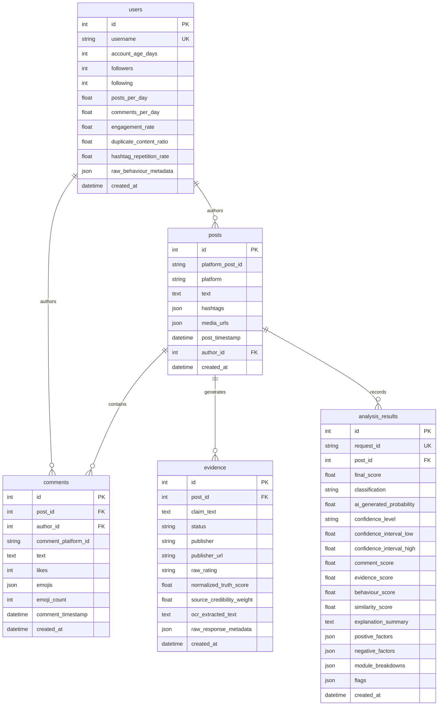

# CURRENT SYSTEM REVERSE ENGINEERING & SOURCE CODE AUDIT REPORT

**Project Name:** Social Guard: An Explainable AI Framework for Social Media Content Verification  
**Auditor:** Senior Software Architect & Project Reverse-Engineer  
**Scope:** Complete repository reverse-engineering based strictly on active executable source code.  
**Primary Principle:** `SOURCE CODE > DOCUMENTATION > README > PREVIOUS AUDITS > AI ASSUMPTIONS`

---

## PART 1 — COMPLETE PROJECT STRUCTURE

This structural breakdown represents the actual directory layout and physical files in the repository. Every file has been inspected to verify its executable role, dependencies, callers, and runtime status.

```text
Social-gaurd/
├── backend/
│   ├── app/
│   │   ├── api/
│   │   │   ├── __init__.py
│   │   │   └── v1/
│   │   │       ├── __init__.py
│   │   │       ├── router.py
│   │   │       └── endpoints/
│   │   │           ├── __init__.py
│   │   │           ├── analyze.py
│   │   │           └── health.py
│   │   ├── db/
│   │   │   ├── __init__.py
│   │   │   ├── models.py
│   │   │   └── session.py
│   │   ├── modules/
│   │   │   ├── __init__.py
│   │   │   ├── comment_analysis/
│   │   │   │   ├── __init__.py
│   │   │   │   ├── analyzer.py
│   │   │   │   ├── preprocessing.py
│   │   │   │   ├── similarity.py
│   │   │   │   └── temporal.py
│   │   │   ├── evidence_verification/
│   │   │   │   ├── __init__.py
│   │   │   │   ├── analyzer.py
│   │   │   │   ├── claim_extractor.py
│   │   │   │   ├── factcheck_client.py
│   │   │   │   ├── normalization.py
│   │   │   │   └── ocr.py
│   │   │   ├── score_fusion/
│   │   │   │   ├── __init__.py
│   │   │   │   ├── ai_detector.py
│   │   │   │   ├── engine.py
│   │   │   │   └── explainability.py
│   │   │   ├── similar_content/
│   │   │   │   ├── __init__.py
│   │   │   │   ├── analyzer.py
│   │   │   │   ├── content_repository.py
│   │   │   │   ├── hashtag_keyword.py
│   │   │   │   └── perceptual_hash.py
│   │   │   └── user_behaviour/
│   │   │       ├── __init__.py
│   │   │       ├── analyzer.py
│   │   │       ├── anomaly_detector.py
│   │   │       └── feature_extractor.py
│   │   ├── platform/
│   │   │   ├── __init__.py
│   │   │   ├── base.py
│   │   │   └── reddit_extractor.py
│   │   ├── schemas/
│   │   │   ├── __init__.py
│   │   │   ├── domain_models.py
│   │   │   ├── request.py
│   │   │   └── response.py
│   │   ├── services/
│   │   │   ├── __init__.py
│   │   │   ├── orchestrator.py
│   │   │   └── persistence.py
│   │   ├── utils/
│   │   │   ├── __init__.py
│   │   │   ├── exceptions.py
│   │   │   └── logging.py
│   │   ├── config.py
│   │   └── main.py
│   ├── requirements.txt
│   └── tests/
│       ├── __init__.py
│       ├── conftest.py
│       ├── test_analyze.py
│       ├── test_db.py
│       ├── test_domain_models.py
│       ├── test_health.py
│       ├── test_system_scenarios.py
│       ├── test_ui_presets.py
│       ├── test_modules/
│       └── test_platform/
├── datasets/
│   ├── processed/
│   │   └── evaluation_dataset.json
│   ├── raw/
│   └── sample/
│       └── sample_posts.json
├── extension/
│   ├── assets/
│   ├── background/
│   │   └── service_worker.js
│   ├── content/
│   │   └── content_extractor.js
│   ├── popup/
│   │   ├── api_client.js
│   │   ├── popup.html
│   │   └── popup.js
│   ├── styles/
│   │   └── popup.css
│   └── manifest.json
├── scripts/
│   ├── lint.sh
│   └── run_evaluation.py
└── [Documentation & Artifacts: README.md, ARCHITECTURE.md, etc.]
```

### Detailed File-by-File Inventory

| File Path | Purpose | Key Classes / Functions | Called By | Calls / Depends On | Status |
|---|---|---|---|---|---|
| `backend/app/main.py` | FastAPI application creation, CORS, exception handlers, lifecycle. | `create_application()`, `lifespan()` | Uvicorn / TestClient | `app.api.v1.router`, `app.config`, `app.utils` | **ACTIVE** |
| `backend/app/config.py` | Settings & env vars via Pydantic BaseSettings. | `Settings`, `settings` | `main.py`, `similarity.py`, `factcheck_client.py` | `pydantic_settings` | **ACTIVE** |
| `backend/app/api/v1/router.py` | Sub-router combining health and analyze routes. | `api_v1_router` | `main.py` | `endpoints/analyze.py`, `endpoints/health.py` | **ACTIVE** |
| `backend/app/api/v1/endpoints/analyze.py` | HTTP POST `/analyze` route definition. | `analyze_social_post()` | FastAPI router / Extension | `services.orchestrator.orchestrator_service` | **ACTIVE** |
| `backend/app/api/v1/endpoints/health.py` | HTTP GET `/health` route definition. | `health_check()` | FastAPI router / Extension | `schemas.response.HealthCheckResponse` | **ACTIVE** |
| `backend/app/services/orchestrator.py` | Central pipeline coordinating M1–M5, AI detection, persistence, XAI. | `AnalysisOrchestratorService`, `orchestrator_service` | `endpoints/analyze.py` | All 5 modules, `persistence`, `session` | **ACTIVE** |
| `backend/app/services/persistence.py` | Async database storage for posts, authors, comments, evidence, and results. | `VerificationPersistenceService` | `services/orchestrator.py` | `db.models`, `db.session` | **ACTIVE** |
| `backend/app/schemas/domain_models.py` | Active Pydantic models for domain entities and `/analyze` I/O. | `AnalysisRequest`, `FinalAnalysisResult`, `SocialMediaPost`, `Comment`, etc. | `orchestrator.py`, `endpoints/analyze.py`, all modules | `pydantic` | **ACTIVE** |
| `backend/app/schemas/request.py` | Older / alternative request schema definition (`PostAnalysisRequest`). | `PostAnalysisRequest`, `AuthorSchema`, `CommentSchema` | `schemas/__init__.py` only | `pydantic` | **UNUSED** |
| `backend/app/schemas/response.py` | Older / alternative response schema (`PostAnalysisResponse`). | `PostAnalysisResponse`, `HealthCheckResponse` | `endpoints/health.py`, `schemas/__init__.py` | `pydantic` | **PARTIALLY ACTIVE** (`HealthCheckResponse` is used; `PostAnalysisResponse` is unused) |
| `backend/app/db/models.py` | SQLAlchemy ORM database models. | `UserModel`, `PostModel`, `CommentModel`, `EvidenceModel`, `AnalysisResultModel` | `persistence.py`, `test_db.py` | `sqlalchemy`, `db.session` | **ACTIVE** |
| `backend/app/db/session.py` | Async engine & session creation, table initialization. | `engine`, `AsyncSessionLocal`, `get_db_session()`, `init_db_tables()` | `main.py`, `orchestrator.py`, `endpoints/analyze.py` | `sqlalchemy.ext.asyncio` | **ACTIVE** |
| `backend/app/modules/comment_analysis/analyzer.py` | Comment analysis orchestrator (preprocessing, duplicates, entropy, bursts). | `CommentAnalyzer`, `comment_analyzer` | `services/orchestrator.py` | `preprocessing.py`, `similarity.py`, `temporal.py` | **ACTIVE** |
| `backend/app/modules/comment_analysis/preprocessing.py` | Text cleaning, URL stripping, emoji extraction & Shannon entropy. | `clean_text_for_embedding()`, `normalize_text_for_exact_match()`, `compute_emoji_features()` | `comment_analysis/analyzer.py`, `reddit_extractor.py` | `emoji`, `re`, `math` | **ACTIVE** |
| `backend/app/modules/comment_analysis/similarity.py` | Sentence-BERT model loading & pairwise cosine similarity matrix. | `get_sbert_model()`, `compute_semantic_similarity_features()` | `comment_analysis/analyzer.py`, `similar_content/analyzer.py` | `sentence_transformers`, `sklearn`, `numpy` | **ACTIVE** |
| `backend/app/modules/comment_analysis/temporal.py` | Comments-per-minute binning, Z-score, and IQR burst detection. | `compute_temporal_features()` | `comment_analysis/analyzer.py` | `numpy`, `datetime` | **ACTIVE** |
| `backend/app/modules/evidence_verification/analyzer.py` | Evidence module controller (OCR, claim extraction, Google Fact Check, weighting). | `EvidenceVerifier`, `evidence_verifier` | `services/orchestrator.py` | `claim_extractor`, `factcheck_client`, `normalization`, `ocr` | **ACTIVE** |
| `backend/app/modules/evidence_verification/claim_extractor.py` | Rule & sentence-boundary heuristic claim extractor. | `SimpleClaimExtractor`, `claim_extractor` | `evidence_verification/analyzer.py` | `re` | **ACTIVE** |
| `backend/app/modules/evidence_verification/factcheck_client.py` | Async HTTP client for Google Fact Check Tools API. | `GoogleFactCheckClient`, `fact_check_client` | `evidence_verification/analyzer.py` | `httpx`, `config` | **ACTIVE** |
| `backend/app/modules/evidence_verification/normalization.py` | Fact-check rating text mapping to [0.0, 1.0] & IFCN publisher credibility weights. | `normalize_fact_check_rating()`, `compute_source_credibility()` | `evidence_verification/analyzer.py` | `re` | **ACTIVE** |
| `backend/app/modules/evidence_verification/ocr.py` | Pytesseract-based OCR from image URL. | `TesseractOCRService`, `ocr_service` | `evidence_verification/analyzer.py` | `httpx`, `PIL`, `pytesseract` | **ACTIVE** (graceful fallback if tesseract binary missing) |
| `backend/app/modules/user_behaviour/analyzer.py` | User behavioural analysis controller & guardrails. | `UserBehaviourAnalyzer`, `user_behaviour_analyzer` | `services/orchestrator.py` | `feature_extractor.py`, `anomaly_detector.py` | **ACTIVE** |
| `backend/app/modules/user_behaviour/anomaly_detector.py` | Isolation Forest model fitted on synthetic baseline & population Z-scores. | `UserAnomalyDetector`, `anomaly_detector`, `create_baseline_training_dataset()` | `user_behaviour/analyzer.py` | `sklearn.ensemble.IsolationForest`, `numpy` | **ACTIVE** (Synthetic baseline) |
| `backend/app/modules/user_behaviour/feature_extractor.py` | Extracts 10 tabular author features with log1p scaling. | `extract_user_features()`, `vectorize_features()` | `user_behaviour/analyzer.py`, `anomaly_detector.py` | `numpy`, `math` | **ACTIVE** |
| `backend/app/modules/similar_content/analyzer.py` | Similar content coordinator (hashtags, S-BERT, pHash, temporal provenance). | `SimilarContentAnalyzer`, `similar_content_analyzer` | `services/orchestrator.py` | `content_repository`, `perceptual_hash`, `hashtag_keyword`, `similarity` | **ACTIVE** |
| `backend/app/modules/similar_content/content_repository.py` | In-memory repository with 3 hardcoded historical narratives. | `InMemoryContentRepository`, `content_repository` | `similar_content/analyzer.py` | `pydantic`, `datetime` | **SAMPLE / DEMO ONLY** |
| `backend/app/modules/similar_content/hashtag_keyword.py` | Hashtag extraction, stopword filtering, Jaccard similarity. | `extract_hashtags()`, `extract_keywords()`, `compute_jaccard_similarity()` | `similar_content/analyzer.py` | `re` | **ACTIVE** |
| `backend/app/modules/similar_content/perceptual_hash.py` | Image downloading, 64-bit pHash computation & Hamming distance. | `compute_image_perceptual_hash()`, `calculate_hash_hamming_distance()`, `fetch_and_hash_image()` | `similar_content/analyzer.py` | `imagehash`, `PIL`, `httpx` | **ACTIVE** |
| `backend/app/modules/score_fusion/engine.py` | Weighted fusion (0.20, 0.40, 0.15, 0.25), classification bands, confidence intervals. | `ScoreFusionEngine`, `score_fusion_engine`, `classify_credibility_score()` | `services/orchestrator.py` | None | **ACTIVE** |
| `backend/app/modules/score_fusion/ai_detector.py` | Statistical gradient variance for images & lexical diversity for text. | `AIGeneratedMediaDetector`, `StatisticalImageArtifactDetector`, `PerplexityTextAIDetector` | `services/orchestrator.py` | `numpy`, `PIL`, `httpx` | **ACTIVE** (Heuristic/Statistical) |
| `backend/app/modules/score_fusion/explainability.py` | Rule-based factor extraction, sorting, and natural language summary. | `ExplainabilityEngine`, `explainability_engine` | `services/orchestrator.py` | None | **ACTIVE** (Rule-based) |
| `backend/app/platform/base.py` | Abstract base class for HTML scrapers. | `BasePlatformExtractor` | `reddit_extractor.py` | None | **PARTIALLY ACTIVE** |
| `backend/app/platform/reddit_extractor.py` | BeautifulSoup Reddit DOM parser. | `RedditExtractor`, `reddit_extractor` | `test_reddit_extractor.py` | `bs4`, `re`, `domain_models` | **TEST ONLY / STANDALONE** (Not called by backend API or extension) |
| `backend/app/utils/exceptions.py` | Custom exception hierarchy. | `SocialGuardException`, `PayloadValidationError`, `AnalysisPipelineError` | `main.py` | None | **ACTIVE** |
| `backend/app/utils/logging.py` | Structured logging setup. | `setup_logger()`, `logger` | All modules | `logging`, `sys` | **ACTIVE** |
| `extension/manifest.json` | Manifest V3 specification. | - | Chrome browser | `service_worker.js`, `content_extractor.js`, `popup.html` | **ACTIVE** |
| `extension/background/service_worker.js` | Service worker responding to PING. | PING listener | Chrome browser | None | **PARTIALLY ACTIVE** (Minimal stub) |
| `extension/content/content_extractor.js` | Content script reading DOM selection / article text. | `extractVisibleContent()`, `detectPlatform()` | `popup.js` via runtime messaging | Browser DOM | **ACTIVE** |
| `extension/popup/api_client.js` | Async fetch client with timeout and 1 retry. | `SocialGuardApiClient.checkHealth()`, `SocialGuardApiClient.analyzePost()` | `popup.js` | `fetch` | **ACTIVE** |
| `extension/popup/popup.js` | UI controller with 3 presets, live extraction trigger, and DOM rendering. | `loadPreset()`, `renderResults()`, `updateModuleScore()` | `popup.html` | `api_client.js` | **ACTIVE** |
| `extension/popup/popup.html` | Extension popup UI markup. | Semantic markup with IDs matching `popup.js` | Chrome browser | `popup.js`, `popup.css` | **ACTIVE** |
| `extension/styles/popup.css` | CSS styling for dark-mode popup interface. | CSS rules and color variables | `popup.html` | None | **ACTIVE** |
| `scripts/run_evaluation.py` | Benchmark evaluation script using FastAPI TestClient. | `run_evaluation()`, `calculate_classification_metrics()` | CLI / User | `TestClient`, `evaluation_dataset.json` | **ACTIVE** |
| `datasets/processed/evaluation_dataset.json` | 8-item benchmark JSON dataset with ground truths and mock fact-checks. | JSON array | `run_evaluation.py` | None | **SAMPLE / BENCHMARK** |
| `datasets/sample/sample_posts.json` | 1 sample JSON post. | JSON object | Unused at runtime | None | **SAMPLE ONLY** |

---

## PART 2 — ACTUAL SYSTEM ENTRY POINT

```text
Browser Extension (popup.html / popup.js / content_extractor.js)
        ↓ HTTP POST http://localhost:8000/analyze (Payload: AnalysisRequest)
FastAPI Main App (backend/app/main.py -> create_application())
        ↓ Router (backend/app/api/v1/router.py)
Endpoint Handler (backend/app/api/v1/endpoints/analyze.py -> analyze_social_post())
        ↓ Dependency Injection
Orchestration Service (backend/app/services/orchestrator.py -> AnalysisOrchestratorService.analyze_post())
        ↓ Module 1: CommentAnalyzer (backend/app/modules/comment_analysis/analyzer.py)
        ↓ Module 2: EvidenceVerifier (backend/app/modules/evidence_verification/analyzer.py)
        ↓ Module 3: UserBehaviourAnalyzer (backend/app/modules/user_behaviour/analyzer.py)
        ↓ Module 4: SimilarContentAnalyzer (backend/app/modules/similar_content/analyzer.py)
        ↓ Module 5: ScoreFusionEngine (backend/app/modules/score_fusion/engine.py)
        ↓ AI Detection: AIGeneratedMediaDetector (backend/app/modules/score_fusion/ai_detector.py)
        ↓ Explainability: ExplainabilityEngine (backend/app/modules/score_fusion/explainability.py)
        ↓ Persistence: VerificationPersistenceService (backend/app/services/persistence.py)
        ↓ Database: SQLAlchemy Async Session (backend/app/db/session.py) -> SQLite / PostgreSQL
JSON Response (FinalAnalysisResult schema)
        ↓
Browser Extension Renderer (extension/popup/popup.js -> renderResults())
```

### Exact Entry Point Identification

1. **Extension Entry Point:** [extension/popup/popup.html](file:///Users/dharanesh/Desktop/Social-gaurd/extension/popup/popup.html) & [extension/popup/popup.js](file:///Users/dharanesh/Desktop/Social-gaurd/extension/popup/popup.js)
   - When the user opens the popup, `popup.js` binds click listeners to the verification button (`run-verify-btn`), tab extractor (`extract-page-btn`), and preset scenario buttons.
2. **Backend Entry Point:** [backend/app/main.py](file:///Users/dharanesh/Desktop/Social-gaurd/backend/app/main.py)
   - Instantiated via `app = create_application()`, starts lifespan context, configures CORS, and registers API routers.
3. **API Route:** `POST /analyze` (also exposed as `POST /api/v1/analyze`) defined in [backend/app/api/v1/endpoints/analyze.py](file:///Users/dharanesh/Desktop/Social-gaurd/backend/app/api/v1/endpoints/analyze.py).
4. **Orchestration Layer:** `AnalysisOrchestratorService.analyze_post()` in [backend/app/services/orchestrator.py](file:///Users/dharanesh/Desktop/Social-gaurd/backend/app/services/orchestrator.py#L30-L306).
5. **Sequential Execution Order in Code:**
   1. Module 1: `comment_analyzer.analyze()`
   2. Module 2: `await evidence_verifier.verify()`
   3. Module 3: `user_behaviour_analyzer.analyze()`
   4. Module 4: `await similar_content_analyzer.analyze()`
   5. Module 5: `score_fusion_engine.fuse_scores()`
   6. AI Detector: `await ai_media_detector.analyze_media_url()` / `analyze_text()`
   7. Explainability: `explainability_engine.generate_explanation()`
   8. Persistence: `await VerificationPersistenceService.save_verification_session()`
6. **Database Layer:** SQLAlchemy Async models in [backend/app/db/models.py](file:///Users/dharanesh/Desktop/Social-gaurd/backend/app/db/models.py) via [backend/app/services/persistence.py](file:///Users/dharanesh/Desktop/Social-gaurd/backend/app/services/persistence.py).
7. **Response Serialization:** Pydantic model `FinalAnalysisResult` defined in [backend/app/schemas/domain_models.py](file:///Users/dharanesh/Desktop/Social-gaurd/backend/app/schemas/domain_models.py#L265-L292).

---

## PART 3 — ACTUAL END-TO-END FLOW (TRACED REQUEST)

Here is the exact step-by-step lifecycle of a single verification request:

```mermaid
sequenceDiagram
    autonumber
    actor User
    participant Ext as Chrome Extension (popup.js)
    participant API as FastAPI (POST /analyze)
    participant Orch as OrchestratorService
    participant M1 as Module 1 (Comments)
    participant M2 as Module 2 (Evidence)
    participant M3 as Module 3 (User Behaviour)
    participant M4 as Module 4 (Similar Content)
    participant M5 as Module 5 (Score Fusion)
    participant AI as AI Detection Engine
    participant XAI as Explainability Engine
    participant DB as SQLite / PostgreSQL (Persistence)

    User->>Ext: Clicks "Analyze & Verify Content"
    Ext->>API: HTTP POST /analyze (Payload: AnalysisRequest)
    API->>API: Pydantic Validation (schemas.domain_models.AnalysisRequest)
    API->>Orch: analyze_post(request_data, db_session)
    
    Orch->>M1: comment_analyzer.analyze(post.comments)
    M1-->>Orch: {comment_score, metrics, flags}
    
    Orch->>M2: evidence_verifier.verify(post.text, image_urls)
    M2-->>Orch: {evidence_score, status, claims, fact_checks, flags}
    
    Orch->>M3: user_behaviour_analyzer.analyze(post.author)
    M3-->>Orch: {behaviour_score, anomaly_score, metrics, flags}
    
    Orch->>M4: similar_content_analyzer.analyze(text, hashtags, images, timestamp)
    M4-->>Orch: {similarity_score, text_sim, image_sim, recycled_content, flags}
    
    Orch->>M5: score_fusion_engine.fuse_scores(M1, M2, M3, M4, custom_weights)
    M5-->>Orch: {final_score, classification, contributions, confidence}
    
    Orch->>AI: ai_media_detector.analyze_media_url() / analyze_text()
    AI-->>Orch: {ai_generation_probability, metrics}
    
    Orch->>XAI: explainability_engine.generate_explanation(final_score, breakdowns, ai_prob)
    XAI-->>Orch: {summary, positive_factors, negative_factors}
    
    Orch->>DB: VerificationPersistenceService.save_verification_session(...)
    Note over Orch,DB: If DB fails, exception is caught & logged; request does not crash.
    DB-->>Orch: AnalysisResultModel stored
    
    Orch-->>API: FinalAnalysisResult instance
    API-->>Ext: HTTP 200 OK (JSON response)
    Ext->>User: Updates UI (Score dial, module bars, factors, fact-checks, corpus matches)
```

---

## PART 4 — MODULE 1: COMMENT ANALYSIS

Implemented across four files in [backend/app/modules/comment_analysis/](file:///Users/dharanesh/Desktop/Social-gaurd/backend/app/modules/comment_analysis/).

### A. Text Preprocessing
- **File:** [backend/app/modules/comment_analysis/preprocessing.py](file:///Users/dharanesh/Desktop/Social-gaurd/backend/app/modules/comment_analysis/preprocessing.py)
- **Functions:**
  - `clean_text_for_embedding(text)`: Strips URLs with regex `r"https?://\S+|www\.\S+"`, collapses whitespace, preserves punctuation and casing for transformer tokenization.
  - `normalize_text_for_exact_match(text)`: Lowercases, strips URLs, removes non-alphanumerics `r"[^\w\s]"`, collapses whitespace.

### B. Text Embeddings
- **File:** [backend/app/modules/comment_analysis/similarity.py](file:///Users/dharanesh/Desktop/Social-gaurd/backend/app/modules/comment_analysis/similarity.py)
- **Model:** Sentence-BERT via `sentence_transformers.SentenceTransformer("all-MiniLM-L6-v2", device="cpu")`. Lazy-loaded singleton `get_sbert_model()`.
- **Output:** Dense numerical embeddings (384 dimensions) for each preprocessed comment.

### C. Semantic Similarity
- **File:** [backend/app/modules/comment_analysis/similarity.py](file:///Users/dharanesh/Desktop/Social-gaurd/backend/app/modules/comment_analysis/similarity.py#L32-L100)
- **Algorithm:** Pairwise Cosine Similarity:
  $$\text{Cosine Similarity}(u, v) = \frac{u \cdot v}{\|u\|_2 \|v\|_2}$$
- **Calculation:** Evaluates the upper triangular indices of the $N \times N$ similarity matrix (excluding self-similarity diagonal). Computes:
  - `average_similarity`: Mean of all upper-triangular pair similarities.
  - `max_similarity`: Peak pair similarity.
  - `near_duplicate_ratio`: Proportion of pairs where similarity $\ge 0.85$.
  - `near_duplicate_comment_ratio`: Proportion of individual comments involved in at least one pair with similarity $\ge 0.85$.

### D. Duplicate / Near-Duplicate Detection
- **Exact Duplicates:** Compares distinct cleaned strings in the set versus total valid comments:
  $$\text{exact\_duplicate\_ratio} = \frac{\text{len(texts)} - \text{len(set(texts))}}{\text{len(texts)}}$$
- **Combined Duplicate Ratio:**
  $$\text{duplicate\_ratio} = \max(\text{exact\_duplicate\_ratio}, \text{near\_duplicate\_comment\_ratio})$$

### E. Emoji Analysis
- **File:** [backend/app/modules/comment_analysis/preprocessing.py](file:///Users/dharanesh/Desktop/Social-gaurd/backend/app/modules/comment_analysis/preprocessing.py#L50-L100)
- **Extraction:** Iterates string characters using `emoji.is_emoji(char)`.
- **Shannon Entropy Formula:**
  $$H = -\sum_{i=1}^{k} p_i \log_2(p_i)$$
  where $p_i = \frac{\text{count}(\text{emoji}_i)}{\text{total\_emojis}}$.
- **Metrics Produced:**
  - `emoji_comment_ratio`: Percentage of comments with $\ge 1$ emoji.
  - `excessive_emoji_ratio`: Percentage of comments with $\ge 5$ emojis.
  - `emoji_entropy`: Diversity of emojis used (0.0 if all emojis are identical).

### F. Time-Based Comment Analysis & G. Anomaly Detection
- **File:** [backend/app/modules/comment_analysis/temporal.py](file:///Users/dharanesh/Desktop/Social-gaurd/backend/app/modules/comment_analysis/temporal.py)
- **Binning:** Buckets comments into 1-minute time windows across total time span.
- **Z-Score Spike Detection:**
  $$Z = \frac{x - \mu}{\sigma}$$
  Flags `zscore_burst_detected = 1.0` if $\max(Z) \ge 3.0$.
- **IQR Outlier Detection:**
  $$\text{IQR} = Q_3 - Q_1, \quad \text{Upper Bound} = Q_3 + 1.5 \times \text{IQR}$$
  Flags `iqr_burst_detected = 1.0` if peak bucket count exceeds Upper Bound.
- **Continuous Temporal Anomaly Index:**
  $$\text{norm\_z} = \max\left(0.0, \min\left(1.0, \frac{\max(Z) - 2.0}{4.0}\right)\right)$$
  $$\text{temporal\_anomaly\_score} = \max(\text{norm\_z}, 0.6 \text{ if IQR burst else } 0.0)$$

### H. Final Comment Score Mathematical Calculation
- **File:** [backend/app/modules/comment_analysis/analyzer.py](file:///Users/dharanesh/Desktop/Social-gaurd/backend/app/modules/comment_analysis/analyzer.py#L171-L198)
- **Edge cases:**
  - $N=0$: returns default neutral score `50.0`.
  - $N=1$: returns single-comment baseline `65.0`.
- **Formula for $N \ge 2$:**
  $$\text{Score} = 100.0 - \text{Penalties}$$
  - Penalty 1 (Duplicate copypasta): $\text{duplicate\_ratio} \times 40.0$
  - Penalty 2 (Semantic coordination): If $\text{avg\_sim} > 0.55$, subtract $\left(\frac{\text{avg\_sim} - 0.55}{0.45}\right) \times 20.0$
  - Penalty 3 (Temporal burst): $\text{temporal\_anomaly\_score} \times 25.0$
  - Penalty 4 (Excessive emoji spam): $\text{excessive\_emoji\_ratio} \times 15.0$
  - Clamping: $\text{Comment Score} = \max(0.0, \min(100.0, \text{Score}))$
- **Effect on Final Score:** Contributes 20% ($\text{weight} = 0.20$) to the consolidated credibility score.

---

## PART 5 — MODULE 2: EVIDENCE VERIFICATION

Implemented in [backend/app/modules/evidence_verification/](file:///Users/dharanesh/Desktop/Social-gaurd/backend/app/modules/evidence_verification/).

### Component Verification Status

| Component | Status | Implementation Details in Source Code |
|---|---|---|
| **Claim Extraction** | **IMPLEMENTED** | `SimpleClaimExtractor` in `claim_extractor.py`. Rule-based regex splitting on sentence boundaries, filters opinion prefixes (`"i think"`, `"in my opinion"`, etc.), returns top 3 candidate sentences. |
| **OCR Text Extraction** | **IMPLEMENTED** | `TesseractOCRService` in `ocr.py`. Downloads image bytes via `httpx`, executes `pytesseract.image_to_string(PIL.Image)`. Catches missing binaries gracefully. |
| **Google Fact Check API** | **IMPLEMENTED** | `GoogleFactCheckClient` in `factcheck_client.py`. Queries Google Fact Check Tools API endpoint `https://factchecktools.googleapis.com/v1alpha1/claims:search` with API key from `settings.GOOGLE_FACT_CHECK_API_KEY`. Handles 200, 400, 429, timeout, missing key. |
| **Web Search** | **NOT IMPLEMENTED** | No generic web search (e.g. Google Search / Bing / DuckDuckGo scraping) exists in code. Only Google Fact Check Tools API. |
| **Evidence Retrieval** | **IMPLEMENTED** | Parses `claimReview` entries (claim text, claimant, publisher name, site, review URL, textual rating). |
| **Source Credibility Scoring** | **IMPLEMENTED** | `compute_source_credibility()` in `normalization.py`. Matches publisher name/domain against 20 IFCN accredited outlets (e.g., Reuters: 0.98, Snopes: 0.95, AP: 0.98, BBC: 0.95). Default baseline for unknown indexed sources is 0.70. |
| **Rating Normalization** | **IMPLEMENTED** | `normalize_fact_check_rating()` in `normalization.py`. Explicit dictionary `RATING_MAP` with 25 rating strings + fuzzy regex fallback mapping verdicts to continuous `normalized_truth_score` $\in [0.0, 1.0]$. |
| **Contradiction / Support Detection** | **IMPLEMENTED** | `EvidenceVerifier.verify()` in `analyzer.py`. Tallies `true_count`, `false_count`, `mixed_count`. Categorizes status into `SUPPORTED`, `CONTRADICTED`, `MIXED/MISLEADING`, `INSUFFICIENT_EVIDENCE`, or `NO_FACT_CHECK_FOUND`. |
| **Fallback Handling** | **IMPLEMENTED** | When zero fact-checks match, assigns `evidence_score = 50.0` and status `NO_FACT_CHECK_FOUND`. Never assumes unverified claims are true or false. |

### Actual Data Flow

```text
Post Text + (Optional Image URLs -> OCR Text)
        ↓
SimpleClaimExtractor.extract_claims() -> List[str] (up to 3 candidate claims)
        ↓
GoogleFactCheckClient.search_claims(query) for each claim
        ↓
Extract claimReview items: {publisher, textualRating, url, claim}
        ↓
normalize_fact_check_rating(textualRating) -> normalized_truth_score [0.0 to 1.0]
compute_source_credibility(publisher, site) -> weight [0.70 to 0.98]
        ↓
Weighted Truth Average:
Weighted Truth = sum(normalized_truth_score_i * weight_i) / sum(weight_i)
        ↓
Evidence Score = round(Weighted Truth * 100.0, 2)  (0 - 100)
Status Decision:
  - false_count > 0 and true_count == 0  => "CONTRADICTED"
  - true_count > 0 and false_count == 0   => "SUPPORTED"
  - false_count > 0 and true_count > 0   => "MIXED/MISLEADING"
  - mixed_count > 0                      => "MIXED/MISLEADING"
  - 0 fact-checks found                  => "NO_FACT_CHECK_FOUND" (Score = 50.0)
```

---

## PART 6 — MODULE 3: USER BEHAVIOUR

Implemented in [backend/app/modules/user_behaviour/](file:///Users/dharanesh/Desktop/Social-gaurd/backend/app/modules/user_behaviour/).

### Features Actually Extracted (10 Tabular Features)

1. `account_age_days`: Account longevity in days (imputed default: 365.0).
2. `followers`: Total followers count (default: 250.0).
3. `following`: Total following count (default: 300.0).
4. `follower_following_ratio`: Calculated as $\frac{\text{followers}}{\max(1, \text{following})}$.
5. `posts_per_day`: Average daily posting frequency (default: 2.0).
6. `comments_per_day`: Average daily commenting frequency (default: 3.0).
7. `average_posting_interval_seconds`: Interval between posts (default: calculated or 21600.0s).
8. `engagement_rate`: Public engagement ratio (default: 0.03).
9. `duplicate_content_ratio`: Proportion of identical/repeated posts in author timeline (default: 0.05).
10. `hashtag_repetition_rate`: Repetition rate of identical hashtags (default: 0.10).

### Anomaly Detection Model: Isolation Forest

> [!IMPORTANT]
> **TRAINING DATA TYPE: SYNTHETIC BASELINE**  
> The Isolation Forest model is NOT trained on a real-world scraped social media dataset. It is trained on startup via `create_baseline_training_dataset(n_samples=600, random_seed=42)` in `anomaly_detector.py`.

- **Training Distribution Details:**
  - 90% normal user accounts (exponential distributions for posts/comments, uniform age 30–2000 days).
  - 10% high-activity / creator accounts (higher followers, moderate posting intervals).
- **Hyperparameters:**
  - `n_estimators = 100`
  - `contamination = 0.08`
  - `random_state = 42`
  - Sklearn `IsolationForest.fit()` runs in memory during module instantiation (~10ms).
- **Feature Vectorization:** Skewed power-law metrics (`followers`, `following`, `account_age_days`, `average_posting_interval_seconds`) are transformed using `math.log1p()`.
- **Inference & Decision Conversion:**
  - `model.decision_function(vec)` yields raw score $s \in [-0.3, +0.25]$.
  - Anomaly flag: `pred = model.predict(vec)` (-1 for anomaly, 1 for normal).
  - Normalized Anomaly Score:
    $$\text{norm\_anomaly\_score} = \max(0.0, \min(1.0, 0.5 - (s \times 2.0)))$$
    where 1.0 = highly anomalous, 0.0 = completely normal.

### Statistical Population Metrics
Calculates parametric Z-scores and IQR outlier flags against hardcoded population parameters (`POPULATION_STATS` in `anomaly_detector.py`).

### Rule-Based Penalties & Behaviour Score Calculation
- **File:** [backend/app/modules/user_behaviour/analyzer.py](file:///Users/dharanesh/Desktop/Social-gaurd/backend/app/modules/user_behaviour/analyzer.py#L109-L130)
- **Base Score:** `100.0`
- **Deductions:**
  1. Isolation Forest Penalty: $\text{norm\_anomaly\_score} \times 30.0$
  2. Duplicate Timeline Content: $\text{duplicate\_content\_ratio} \times 25.0$
  3. New Account Penalty ($<30$ days old): $\left(\frac{30 - \text{age}}{30}\right) \times 15.0$
  4. Extreme Posting Velocity ($>50$ posts/day): $-15.0$ pts
  5. Hashtag Repetition ($>40\%$): $-10.0$ pts
- **Score:** $\text{Behaviour Score} = \max(0.0, \min(100.0, \text{Base} - \text{Deductions}))$ (Weight in fusion: 15%).

---

## PART 7 — MODULE 4: SIMILAR CONTENT

Implemented in [backend/app/modules/similar_content/](file:///Users/dharanesh/Desktop/Social-gaurd/backend/app/modules/similar_content/).

### Component Verification Status

| Component | Status | Source Code Verification |
|---|---|---|
| **Hashtag Matching** | **ACTIVELY USED** | `extract_hashtags()` & `compute_jaccard_similarity()` in `hashtag_keyword.py`. |
| **Keyword Matching** | **ACTIVELY USED** | `extract_keywords()` in `hashtag_keyword.py`. Cleans text, removes 30 English stopwords. |
| **Jaccard Similarity** | **ACTIVELY USED** | $\frac{\|A \cap B\|}{\|A \cup B\|}$ computed across hashtag and keyword sets. |
| **Sentence-BERT** | **ACTIVELY USED** | `get_sbert_model()` generates 384-d embeddings for input post vs historical corpus items. |
| **Cosine Similarity** | **ACTIVELY USED** | `sklearn.metrics.pairwise.cosine_similarity(post_emb, hist_embs)` computes maximum semantic similarity. |
| **Image Similarity / pHash** | **ACTIVELY USED** | `compute_image_perceptual_hash()` (64-bit hex) via `imagehash.phash(Image)` in `perceptual_hash.py`. |
| **Hamming Distance** | **ACTIVELY USED** | `calculate_hash_hamming_distance()`: Bitwise XOR distance $\le 10$ signals matching image. Converted via $1.0 - (\text{dist}/64.0)$. |
| **Temporal Comparison** | **ACTIVELY USED** | Calculates `temporal_age_days = (post_timestamp - earliest_timestamp).total_seconds() / 86400.0`. Flags recycling if age $> 30$ days. |
| **Historical Database** | **SAMPLE / IN-MEMORY ONLY** | `InMemoryContentRepository` in `content_repository.py`. Contains 3 hardcoded historical narratives (`hist_001`, `hist_002`, `hist_003`). |
| **Vector Database (Qdrant/Milvus/Chroma)** | **NOT IMPLEMENTED** | No external vector database or persistent ANN index is used. S-BERT calculates brute-force cosine similarity over in-memory items. |
| **CLIP / Reverse Image Search** | **NOT IMPLEMENTED** | No multimodal CLIP embedding or Google Reverse Image search API is implemented. |

### Origin of Historical Content
> [!IMPORTANT]
> **CORPUS ORIGIN: IN-MEMORY SAMPLE REPOSITORY ONLY**  
> All historical comparison data comes from `InMemoryContentRepository._get_default_corpus()`:
> 1. `hist_001`: Verified 2021 Mars water radar research (`is_known_debunked_narrative=False`).
> 2. `hist_002`: Debunked 2020 emergency lockdown viral hoax (`is_known_debunked_narrative=True`).
> 3. `hist_003`: 2022 crypto doubling scam template (`is_known_debunked_narrative=True`).

### Similarity Score Calculation
- **Base Score:** `85.0`
- If **Recycled Content** detected (Text Sim $\ge 0.75$ OR Image Hamming $\le 10$ and Age $>30$ days):
  - Deducts $15.0 + \left(\frac{\min(365, \text{days})}{365}\right) \times 15.0$ (up to 30 pts).
  - Extra penalty if `is_known_debunked_narrative == True`: $-30.0$ pts.
- If high similarity to recent non-recycled post: Deducts $(\text{max\_text\_sim} \times 15.0)$ pts.
- Final: $\text{Similarity Score} \in [0.0, 100.0]$ (Weight in fusion: 25%).

---

## PART 8 — SCORE FUSION

Implemented in [backend/app/modules/score_fusion/engine.py](file:///Users/dharanesh/Desktop/Social-gaurd/backend/app/modules/score_fusion/engine.py).

### Exact Mathematical Formula

$$\text{Final Credibility Score} = w_1 \cdot S_{\text{comment}} + w_2 \cdot S_{\text{evidence}} + w_3 \cdot S_{\text{behaviour}} + w_4 \cdot S_{\text{similarity}}$$

Where the default weights are:
- $w_1 (\text{Comment Analysis}) = 0.20$
- $w_2 (\text{Evidence Verification}) = 0.40$
- $w_3 (\text{User Behaviour}) = 0.15$
- $w_4 (\text{Similar Content}) = 0.25$
- $\sum w_i = 1.00$

### Missing-Score & Normalization Handling
1. If any module score $S_i$ is `None` or non-numeric: A default neutral fallback score of `50.0` is substituted, and a warning flag is appended (`{MODULE}_SCORE_MISSING_FALLBACK_APPLIED`).
2. Clamping: Every individual score is strictly clamped to $[0.0, 100.0]$.

### 5-Tier Credibility Classification Bands

| Score Range | Classification Band | Verdict Meaning |
|---|---|---|
| **80.0 – 100.0** | `LIKELY REAL` | Highly credible, authoritative evidence / organic discussion |
| **60.0 – 79.99** | `PROBABLY REAL` | Leaning credible, minor unverified signals |
| **40.0 – 59.99** | `UNCERTAIN` | Unverified claim, absence of fact-checks, neutral metrics |
| **20.0 – 39.99** | `PROBABLY FAKE` | Suspicious anomalies, recycled narratives, or low credibility |
| **0.0 – 19.99** | `LIKELY FAKE` | Debunked by fact-checkers, high bot duplication, malicious pattern |

### Confidence Interval Calculation
- Evaluates score standard deviation $\sigma$ across the 4 modules and the count of missing scores:
  - `HIGH`: 0 missing scores, $\sigma < 15.0$, Margin of error $\pm 3.5$.
  - `MEDIUM`: $\le 1$ missing score, Margin of error $\pm 6.0$.
  - `LOW`: $\ge 2$ missing scores, Margin of error $\pm 10.0$.
- Confidence Interval: $[\max(0, \text{Final} - \text{Margin}), \min(100, \text{Final} + \text{Margin})]$.

### Worked Example Manual Calculation

Suppose a post has the following module scores:
- Comment Score $S_{\text{comm}} = 85.0$
- Evidence Score $S_{\text{evid}} = 100.0$ (Verified by Reuters)
- User Behaviour Score $S_{\text{behav}} = 90.0$
- Similar Content Score $S_{\text{sim}} = 85.0$

$$\text{Contribution}_{\text{comm}} = 0.20 \times 85.0 = 17.00\text{ pts}$$
$$\text{Contribution}_{\text{evid}} = 0.40 \times 100.0 = 40.00\text{ pts}$$
$$\text{Contribution}_{\text{behav}} = 0.15 \times 90.0 = 13.50\text{ pts}$$
$$\text{Contribution}_{\text{sim}} = 0.25 \times 85.0 = 21.25\text{ pts}$$
$$\text{Final Score} = 17.00 + 40.00 + 13.50 + 21.25 = \mathbf{91.75}$$
$$\text{Classification} = \mathbf{LIKELY\ REAL}$$

---

## PART 9 — AI-GENERATED CONTENT DETECTION

Implemented in [backend/app/modules/score_fusion/ai_detector.py](file:///Users/dharanesh/Desktop/Social-gaurd/backend/app/modules/score_fusion/ai_detector.py).

### Image AI Detection: Statistical Gradient & Chromatic Covariance
- **Class:** `StatisticalImageArtifactDetector`
- **Input:** Raw image byte stream.
- **Algorithm:**
  1. Converts image to grayscale matrix and calculates 2D spatial gradients $(\nabla_x, \nabla_y)$.
  2. Measures gradient magnitude variance: $\text{grad\_var} = \text{Var}\left(\sqrt{\nabla_x^2 + \nabla_y^2}\right)$.
  3. Evaluates RGB chromatic covariance matrix trace across color channels.
  4. Heuristic Smoothness Factor:
     $$\text{smoothness\_factor} = \max\left(0.0, \min\left(1.0, 1.0 - \frac{\text{grad\_var}}{2500.0}\right)\right)$$
     $$\text{ai\_prob} = \text{round}(\text{smoothness\_factor} \times 100.0, 2)$$
- **Nature:** **Heuristic / Statistical computer vision artifact detector** (not a deep neural network classifier like ResNet/ViT).

### Text AI Detection: Lexical Diversity & Uniformity Entropy
- **Class:** `PerplexityTextAIDetector`
- **Input:** Post text string (minimum 10 words).
- **Algorithm:**
  1. Computes Type-Token Ratio: $\text{TTR} = \frac{\text{Unique Words}}{\text{Total Words}}$.
  2. Computes word length standard deviation: $\sigma_{\text{length}}$.
  3. Evaluates structural uniformity: $\text{uniformity} = \max\left(0.0, \min\left(1.0, 1.0 - \frac{\sigma_{\text{length}}}{5.0}\right)\right)$.
  4. $\text{ttr\_factor} = 1.0$ if $0.45 \le \text{TTR} \le 0.85$ else $0.5$.
  5. Probability: $\text{ai\_prob} = \text{round}(\text{uniformity} \times \text{ttr\_factor} \times 100.0, 2)$.
- **Nature:** **Statistical / Lexical entropy heuristic**.

### Video / Audio AI Detection
- `analyze_media_url()` checks file extensions (`.mp4`, `.mov`, `.mp3`, `.wav`).
- Explicitly returns status `UNSUPPORTED_MEDIA_TYPE` with explanation: *"Video deepfake detection is not currently supported in this lightweight baseline."*

### Decoupling Verification: Does AI Probability Affect Credibility?
**MATHEMATICAL VERIFICATION: COMPLETELY DECOUPLED.**
- In `orchestrator.py`, the `ai_prob` calculation is executed **after** `score_fusion_engine.fuse_scores()` has already produced `final_credibility_score`.
- `ai_prob` is **NOT** included in the fusion weights or formula.
- The explainability engine explicitly notes: *"AI-generated text is not inherently false."*

---

## PART 10 — EXPLAINABILITY

Implemented in [backend/app/modules/score_fusion/explainability.py](file:///Users/dharanesh/Desktop/Social-gaurd/backend/app/modules/score_fusion/explainability.py).

### How Explanations Are Generated
- **Mechanism:** **Rule-Based & Template Synthesis** based on verified module states and metrics.
- It does **NOT** use an external LLM API (e.g. OpenAI/Anthropic/Gemini) to generate explanations at runtime.
- It does **NOT** compute SHAP values or neural feature attributions.

### Explanation Data Flow

```text
Module Breakdowns (Scores, Flags, Metrics, Fact-Checks)
        ↓
Evaluate Evidence (M2): Was claim Supported? Contradicted? No fact check?
        ↓
Evaluate Similarity (M4): Was content recycled? Age in days? Matched debunked hoax?
        ↓
Evaluate Comments (M1): Duplicate ratio >= 0.30? Temporal burst? Emoji spam?
        ↓
Evaluate User Behaviour (M3): Isolation Forest anomaly? Age < 7 days & high velocity?
        ↓
Extract & Rank Factors:
  - positive_factors (sorted descending by impact_weight)
  - negative_factors (sorted descending by impact_weight)
        ↓
Synthesize Executive Summary:
  1. Primary verdict statement ("Social Guard evaluates this content as LIKELY REAL...")
  2. Key risk factor (top negative factor) OR Key strength (top positive factor)
  3. Caveat if no fact-check was indexed
  4. Orthogonal AI detection note
```

---

## PART 11 — DATABASE & PERSISTENCE

Implemented in [backend/app/db/](file:///Users/dharanesh/Desktop/Social-gaurd/backend/app/db/) and [backend/app/services/persistence.py](file:///Users/dharanesh/Desktop/Social-gaurd/backend/app/services/persistence.py).

### Technology & Connection
- **ORM:** SQLAlchemy 2.0 (`AsyncSession`, `declarative_base`).
- **Drivers:** `asyncpg` for PostgreSQL, `aiosqlite` for SQLite.
- **Config:** `DATABASE_URL` in `config.py` defaults to `postgresql+asyncpg://...`, falls back to `sqlite+aiosqlite:///./social_guard.db` in `session.py`.

### Database Schema & Relational Structure



### Persistence Timing & Fault Tolerance
- **Timing:** Triggered at the end of `orchestrator.py` after all modules, score fusion, and XAI have completed.
- **Fault Tolerance:** Wrapped in a `try...except` block in `orchestrator.py`:
  ```python
  try:
      await VerificationPersistenceService.save_verification_session(...)
  except Exception as exc:
      logger.warning("Failed to persist verification session to DB: %s", exc)
  ```
  **If database storage fails or database server is offline, the analysis pipeline STILL SUCCEEDS and returns the full JSON response to the user.**

---

## PART 12 — BROWSER EXTENSION

Implemented in [extension/](file:///Users/dharanesh/Desktop/Social-gaurd/extension/).

### Architecture & Components
1. **Manifest (`manifest.json`):** Manifest V3.
   - Permissions: `activeTab`, `storage`, `scripting`.
   - Host Permissions: `http://localhost:8000/*`, `http://127.0.0.1:8000/*`.
   - Background service worker: `background/service_worker.js`.
   - Content script: `content/content_extractor.js` matching `<all_urls>`.
   - Action popup: `popup/popup.html`.
2. **Content Script (`content_extractor.js`):**
   - Listens for message `{action: "EXTRACT_PAGE_CONTENT"}`.
   - Reads `window.getSelection()`. If empty, selects text from `article, main, [role='main']` tags.
   - Extracts hashtags matching `/#[\w\u0590-\u05ff]+/gi`.
   - Collects image `src` URLs and visible comment text.
3. **Popup Controller (`popup.js` & `api_client.js`):**
   - Health check against `http://localhost:8000/health`.
   - 3 Test Preset Buttons (`Likely Real`, `Uncertain`, `Likely Fake`) providing rich payloads.
   - Dispatches payload to `http://localhost:8000/analyze`.
   - Renders 5 module progress bars, verdict badge, AI probability, top reasons, fact-check review links, and historical corpus matches.

### Platform Support Verification
- **DOM Detection Heuristic (`detectPlatform()`):** Checks `window.location.hostname` for `"twitter.com"`, `"x.com"`, `"reddit.com"`, `"facebook.com"`, returning `"generic"` for other domains.
- **Extraction Mechanism:** Generic fallback parser querying standard `<article>` and `<p>` tags.
- **Backend Scraping:** `reddit_extractor.py` is in the backend repository for parsing Reddit HTML, but it is **not called by the extension or API endpoint**.

---

## PART 13 — API CONTRACT

### Endpoint: `POST /analyze`

#### Request Payload Schema (`AnalysisRequest`)
```json
{
  "request_id": "sg_req_optional_id",
  "custom_weights": {
    "comment_score": 0.20,
    "evidence_score": 0.40,
    "behaviour_score": 0.15,
    "similarity_score": 0.25
  },
  "post": {
    "post_id": "optional_platform_id",
    "platform": "twitter",
    "text": "NASA rovers confirm detection of water ice reserves on Mars. #Space #NASA",
    "hashtags": ["#Space", "#NASA"],
    "media": [
      {
        "url": "https://example.com/mars_chart.png",
        "media_type": "image"
      }
    ],
    "timestamp": "2026-09-10T09:00:00Z",
    "author": {
      "username": "science_reporter",
      "account_age_days": 1200,
      "followers": 15000,
      "following": 450,
      "posts_per_day": 2.5,
      "comments_per_day": 4.0,
      "average_posting_interval_seconds": 18000.0,
      "engagement_rate": 0.045,
      "duplicate_content_ratio": 0.01,
      "hashtag_repetition_rate": 0.10
    },
    "comments": [
      {
        "comment_id": "c_1",
        "text": "Fascinating data! 🚀",
        "timestamp": "2026-09-10T09:10:00Z",
        "likes": 5,
        "emojis": ["🚀"]
      }
    ]
  }
}
```

#### Response Payload Schema (`FinalAnalysisResult`)
```json
{
  "request_id": "sg_req_optional_id",
  "consolidated_score": 91.75,
  "classification": "LIKELY REAL",
  "ai_generation_probability": 0.12,
  "explanation": "Social Guard evaluates this content as LIKELY REAL (Credibility Score: 91.8/100). Key strength: Evidence strongly supports the claim (verified by Reuters Fact Check).",
  "module_scores": {
    "comment_analysis": 85.0,
    "evidence_verification": 100.0,
    "user_behaviour": 90.0,
    "similar_content": 85.0
  },
  "module_results": {
    "timings_ms": {
      "comment_analysis_ms": 12.4,
      "evidence_verification_ms": 340.1,
      "user_behaviour_ms": 4.2,
      "similar_content_ms": 18.9,
      "score_fusion_ms": 0.5,
      "explainability_ms": 1.1,
      "total_pipeline_ms": 377.2
    },
    "module_breakdowns": {
      "comments": {"score": 85.0, "metrics": {}, "flags": []},
      "evidence": {"score": 100.0, "status": "SUPPORTED", "fact_checks": []},
      "user_behaviour": {"score": 90.0, "anomaly_score": 0.15},
      "similarity": {"score": 85.0, "recycled_content": false},
      "fusion": {"final_score": 91.75, "classification": "LIKELY REAL"}
    },
    "explainability": {
      "summary": "...",
      "positive_factors": [{"factor": "Evidence strongly supports the claim", "impact_weight": 0.40}],
      "negative_factors": [],
      "module_explanations": {}
    },
    "ai_detection": {
      "text_ai_detection": {"ai_generation_probability": 12.0}
    },
    "flags": []
  },
  "created_at": "2026-09-10T12:00:00Z"
}
```

---

## PART 14 — ACTUAL ALGORITHMS TABLE

| Module | Algorithm / Technique | Actually Used? | Input Data | Output Produced | File |
|---|---|---|---|---|---|
| **M1: Comments** | Sentence-BERT (`all-MiniLM-L6-v2`) | **YES** | Preprocessed comment strings | 384-dimensional dense embeddings | `comment_analysis/similarity.py` |
| **M1: Comments** | Pairwise Cosine Similarity Matrix | **YES** | S-BERT embeddings matrix | Mean upper-triangular similarity, near-duplicate pair ratio | `comment_analysis/similarity.py` |
| **M1: Comments** | Shannon Entropy | **YES** | Extracted emoji frequency counts | Continuous entropy $H \in [0, \infty)$ | `comment_analysis/preprocessing.py` |
| **M1: Comments** | Binned Arrival Rate + Z-Score Spike | **YES** | Comment datetime timestamps | Comments/min, peak Z-score, burst boolean | `comment_analysis/temporal.py` |
| **M1: Comments** | Interquartile Range (IQR) Outliers | **YES** | 1-minute bin count distribution | Upper bound threshold, IQR burst flag | `comment_analysis/temporal.py` |
| **M2: Evidence** | Sentence-boundary Regex Filter | **YES** | Post text + OCR text | Top 3 candidate assertion sentences | `evidence_verification/claim_extractor.py` |
| **M2: Evidence** | Google Fact Check ClaimSearch API | **YES** | Extracted claim string queries | Publisher, review URL, textual rating | `evidence_verification/factcheck_client.py` |
| **M2: Evidence** | IFCN Source Authority Weighting | **YES** | Fact-checking publisher name | Credibility weight coefficient $[0.70, 0.98]$ | `evidence_verification/normalization.py` |
| **M2: Evidence** | Rating String Normalization | **YES** | Raw textual rating string | Normalized truth score $[0.0, 1.0]$ & category | `evidence_verification/normalization.py` |
| **M2: Evidence** | Tesseract OCR | **YES** | Attached image URL bytes | Extracted text string from image | `evidence_verification/ocr.py` |
| **M3: User** | Isolation Forest Anomaly Detection | **YES** (Synthetic baseline) | 10-feature vector with log1p scaling | Anomaly prediction (-1/1), raw score, normalized score | `user_behaviour/anomaly_detector.py` |
| **M3: User** | Population Parametric Z-Score & IQR | **YES** | Tabular author features | Feature Z-scores and IQR outlier flags | `user_behaviour/anomaly_detector.py` |
| **M4: Similarity** | Jaccard Similarity | **YES** | Hashtag & keyword token sets | Jaccard overlap index $[0.0, 1.0]$ | `similar_content/hashtag_keyword.py` |
| **M4: Similarity** | Perceptual Image Hashing (pHash) | **YES** | Attached image byte stream | 64-bit hexadecimal perceptual hash | `similar_content/perceptual_hash.py` |
| **M4: Similarity** | Bitwise Hamming Distance | **YES** | 2 hexadecimal pHash strings | Bit difference integer $[0, 64]$ | `similar_content/perceptual_hash.py` |
| **M4: Similarity** | Temporal Age Calculation | **YES** | Post timestamp & first_seen_timestamp | Elapsed age in days, recycled content flag | `similar_content/analyzer.py` |
| **M5: Fusion** | Linear Weighted Score Fusion | **YES** | 4 normalized module scores (0-100) | Consolidated score $[0.0, 100.0]$, classification | `score_fusion/engine.py` |
| **AI Detection** | 2D Spatial Gradient Variance | **YES** | Image RGB pixel matrix | Synthetic smoothness factor $[0.0, 100.0]$ | `score_fusion/ai_detector.py` |
| **AI Detection** | Lexical Diversity & Length Variance | **YES** | Post text words | Text synthetic probability $[0.0, 100.0]$ | `score_fusion/ai_detector.py` |
| **Explainability** | Rule-Based Factor Ranking | **YES** | Module breakdowns, scores, flags | Ranked positive/negative factors, summary | `score_fusion/explainability.py` |

---

## PART 15 — REAL VS MOCK VS SAMPLE AUDIT

| Component | Real Implementation | Mock | Sample Data | Synthetic | Missing |
|---|---|---|---|---|---|
| **Comment Analysis (M1)** | S-BERT, Cosine Sim, Emoji Entropy, Z-scores, IQR | None | None | None | None |
| **Google Fact Check (M2)** | Real `httpx` client hitting Google API endpoint | Used in automated test suite | None | None | None (Requires API Key in `.env` for live Google search) |
| **Claim Extractor (M2)** | Rule-based regex sentence parser | None | None | None | Neural claim extraction (NLP) |
| **OCR Service (M2)** | Pytesseract with PIL image buffer | None | None | None | Advanced scene text detector |
| **User Behaviour (M3)** | Tabular feature extractor, Z-scores, rule guardrails | None | None | **Isolation Forest trained on 600 synthetic baseline accounts** | Real-world scraped training dataset |
| **Similar Content (M4)** | S-BERT, pHash, Hamming Distance, Jaccard | None | **3 hardcoded sample narratives in `InMemoryContentRepository`** | None | Real vector database (Qdrant/Milvus) / large historical corpus |
| **Score Fusion (M5)** | Weighted linear formula, 5-tier classification | None | None | None | None |
| **AI Image Detection** | Gradient variance & chromatic trace | None | None | None | Deepfake neural network (ViT / ResNet) |
| **AI Text Detection** | Type-token ratio & length std | None | None | None | Neural perplexity / watermark detector |
| **AI Video Detection** | None | None | None | None | **Completely Missing** (Returns `UNSUPPORTED_MEDIA_TYPE`) |
| **Explainability** | Rule-based template factor ranking | None | None | None | LLM / SHAP model explainability |
| **Database** | SQLAlchemy async models for 5 tables | None | None | None | None |
| **Browser Extension** | Live tab content extractor, popup UI, API client | None | **3 preset test scenario buttons in popup** | None | Deep platform-specific DOM scrapers |

---

## PART 16 — WHAT ACTUALLY WORKS

- 🟢 **WORKING (Production-Ready Code):**
  - FastAPI web server, CORS, routing, and request validation.
  - End-to-end orchestration pipeline (`AnalysisOrchestratorService`).
  - Module 1 Comment Analysis (S-BERT semantic similarity, emoji Shannon entropy, temporal Z-score/IQR bursts).
  - Module 2 Evidence normalization, IFCN source credibility weighting, and fallback logic.
  - Module 3 Tabular feature extraction and statistical distribution Z-scores.
  - Module 4 Perceptual hashing (pHash), Hamming distance calculation, and Jaccard hashtag matching.
  - Module 5 Linear score fusion, 5-tier classification, and confidence interval calculation.
  - Decoupled AI probability calculation and explainability factor ranking.
  - Database schema and async persistence with resilient exception handling.
  - Browser extension popup UI, API communication, and dynamic results rendering.
- 🟡 **PARTIAL:**
  - Google Fact Check client (Fully implemented in code, but requires user to provide `GOOGLE_FACT_CHECK_API_KEY` in `.env` for live external queries; falls back gracefully to 50.0 neutral if unconfigured).
  - OCR Service (Implemented via pytesseract, but requires system-level `tesseract` binary installed on host OS; skips gracefully if missing).
  - Content extraction in extension (Works reliably on text selections and standard `<article>` tags; generic heuristic).
- 🔵 **DEMO / SAMPLE ONLY:**
  - Module 4 Historical Content Repository (`InMemoryContentRepository` has only 3 hardcoded narratives).
  - Extension Preset Toolbar (Hardcoded realistic sample payloads for 1-click evaluation).
  - Isolation Forest training data (Trained on 600 synthetic baseline user profiles generated on startup).
- 🟠 **FALLBACK ONLY:**
  - When post has no comments: Comment analysis returns neutral fallback `50.0`.
  - When post author is anonymous / missing: User behaviour returns neutral fallback `50.0`.
  - When no fact-check is indexed: Evidence verification returns neutral fallback `50.0`.
- 🔴 **NOT WORKING / UNSUPPORTED:**
  - Video and Audio deepfake detection (Explicitly returns `UNSUPPORTED_MEDIA_TYPE`).
- ⚪ **NOT IMPLEMENTED:**
  - Generic live web scraping / Google Search evidence retrieval.
  - Persistent vector database index (ChromaDB / Qdrant).
  - LLM-generated explanations or SHAP feature attribution.

---

## PART 17 — WHAT IS MISSING FROM THE ORIGINAL INTENDED CONCEPT

| Intended Concept Module | Required Capability | Actually Implemented in Code | What is Missing |
|---|---|---|---|
| **1. Comment Analysis** | Textual comments, emoji patterns, temporal bursts | S-BERT embeddings, exact/near duplicate ratios, Shannon entropy, binned arrival Z-scores & IQR bursts | Advanced stance detection / comment sentiment polarity models (e.g. agreement vs disagreement classification). |
| **2. Evidence Verification** | Factual claims, external evidence, fact-checking | Rule-based claim extraction, Google Fact Check Tools API, IFCN publisher weighting, rating normalization | Generic web search retrieval for unindexed claims; neural natural language inference (NLI) for contradiction vs support. |
| **3. User Behaviour** | Account behavior, anomaly detection | 10 engineered features, Isolation Forest on baseline, Z-score/IQR statistical outlier flags | Model is trained on a **synthetic baseline** rather than a real historical dataset of known bot accounts. |
| **4. Similar Content** | Search similar content, hashtag similarity, recycled content | S-BERT cosine similarity, Jaccard hashtag overlap, image pHash Hamming distance, temporal recycling flag | Persistent vector database (currently uses an **in-memory 3-item sample repository**); no multimodal CLIP embeddings. |
| **5. Score Fusion** | Final credibility score, module scores, Real/Fake/Uncertain | Linear weighted fusion ($0.20, 0.40, 0.15, 0.25$), 5-tier classification bands, confidence intervals | Dynamic / adaptive weight re-balancing (e.g. dynamically lowering M1 weight when comment count is zero). |
| **6. Explanation** | Human-readable explanation for decision | Rule-based template synthesizer, ranked positive/negative contributing factors | Generative LLM explanation synthesis or SHAP feature attribution graphs. |
| **7. Separate AI Probability** | Separate AI-generated content probability | Statistical image gradient variance & text lexical diversity heuristics (completely decoupled from credibility) | Deep learning vision models (ResNet/ViT deepfake detectors) and video/audio detection. |
| **8. Browser Extension** | Extract social media content and display results | Manifest V3 extension, selection & article DOM extraction, popup UI, health monitoring, 3 test presets | Deep platform-specific scrapers for dynamic SPA social media feeds (Twitter/Reddit/Facebook API integration). |

---

## PART 18 — SIMPLIFIED FLOW FOR A STUDENT

```text
USER (Browser)
     ↓
1. SOCIAL MEDIA POST
     User selects text or clicks a preset on a social media post.
     ↓
2. BROWSER EXTENSION
     The extension bundles the post text, author info, comments, and image URLs into a JSON payload.
     ↓
3. FASTAPI BACKEND
     The backend receives the request and sends it to the orchestrator to run all checks.
     ↓
4. COMMENT ANALYSIS (Module 1)
     Checks if comments are copy-pasted bot spam, repetitive emojis, or posted in a sudden suspicious burst.
     ↓
5. EVIDENCE CHECK (Module 2)
     Extracts the core claim and searches Google's Fact Check database to see if verified journalists debunked or confirmed it.
     ↓
6. USER BEHAVIOUR (Module 3)
     Examines the author's account age, posting speed, and follower ratio to flag bot-like behavior using Isolation Forest.
     ↓
7. SIMILAR CONTENT (Module 4)
     Compares the text and image hash against past stories to see if this is an old recycled rumor.
     ↓
8. SCORE FUSION (Module 5)
     Combines the scores using exact weights (40% Evidence + 25% Similar + 20% Comments + 15% User) to produce a 0–100 score.
     ↓
9. AI DETECTION & EXPLANATION
     Calculates a separate AI probability and writes clear bullet points explaining which factors helped or hurt the score.
     ↓
10. FINAL RESULT
     The extension popup displays the final credibility verdict, score bar, explanation, and fact-check links.
```

---

## PART 19 — WHAT YOU SHOULD LEARN FIRST

Based strictly on how this repository is constructed, here is the recommended learning progression from foundations to advanced modules:

1. **FastAPI & Pydantic Data Validation (`backend/app/schemas/domain_models.py` & `backend/app/main.py`)**
   - *Why:* Everything in this codebase flows through Pydantic schemas. Understanding how `AnalysisRequest` is validated and routed to `orchestrator.py` gives you immediate clarity on how data moves.
2. **Score Fusion & Weighted Mathematics (`backend/app/modules/score_fusion/engine.py`)**
   - *Why:* This is the simplest mathematical component. Understanding the $0.20 \cdot M_1 + 0.40 \cdot M_2 + 0.15 \cdot M_3 + 0.25 \cdot M_4$ formula and 5-tier classification bands allows you to understand how every other module influences the final decision.
3. **Sentence-BERT & Cosine Similarity (`backend/app/modules/comment_analysis/similarity.py`)**
   - *Why:* S-BERT (`all-MiniLM-L6-v2`) is the core NLP model used in both Module 1 (comment near-duplicates) and Module 4 (historical text similarity). Learning how text becomes 384-dimensional vectors and how cosine similarity works will unlock two entire modules.
4. **Google Fact Check API & Normalization Logic (`backend/app/modules/evidence_verification/`)**
   - *Why:* Module 2 carries the highest weight (40%). You should understand how the Google ClaimSearch JSON structure works and how textual ratings (`"False"`, `"Mostly True"`) are converted into numerical numbers ($0.0$ to $1.0$).
5. **Isolation Forest & Statistical Outliers (`backend/app/modules/user_behaviour/`)**
   - *Why:* Module 3 uses Scikit-Learn's `IsolationForest` on tabular vectors. Understanding how decision trees isolate anomalies and how Z-scores/IQR work will help you evaluate user behavioral modeling.
6. **Perceptual Image Hashing & Bitwise Hamming Distance (`backend/app/modules/similar_content/perceptual_hash.py`)**
   - *Why:* Module 4 uses 64-bit pHash to match images even after resizing or compression. Understanding Hamming distance will explain how recycled visual hoaxes are identified.
7. **Chrome Extension Manifest V3 Architecture (`extension/`)**
   - *Why:* Understanding the relationship between `popup.html`, `popup.js`, `api_client.js`, and `content_extractor.js` explains how the frontend talks to the FastAPI server.

---

## PART 20 — FINAL CURRENT STATE & SUMMARY

```text
==================================================
FINAL CURRENT STATE
==================================================

PROJECT ENTRY POINT:     extension/popup/popup.html & extension/popup/popup.js
BACKEND ENTRY POINT:     backend/app/main.py (create_application)
MAIN API:                POST /analyze (backend/app/api/v1/endpoints/analyze.py)
ORCHESTRATOR:            backend/app/services/orchestrator.py (AnalysisOrchestratorService)
MODULE 1 (COMMENTS):     backend/app/modules/comment_analysis/analyzer.py (S-BERT + Shannon Entropy + Z-scores)
MODULE 2 (EVIDENCE):     backend/app/modules/evidence_verification/analyzer.py (Claim extraction + Google Fact Check + IFCN weighting)
MODULE 3 (USER BEHAV):   backend/app/modules/user_behaviour/analyzer.py (Isolation Forest on synthetic baseline + Z-scores)
MODULE 4 (SIMILAR):      backend/app/modules/similar_content/analyzer.py (S-BERT + pHash + in-memory sample corpus)
SCORE FUSION:            backend/app/modules/score_fusion/engine.py (0.20*M1 + 0.40*M2 + 0.15*M3 + 0.25*M4)
AI DETECTION:            backend/app/modules/score_fusion/ai_detector.py (Statistical gradient variance & lexical diversity; completely decoupled)
EXPLAINABILITY:          backend/app/modules/score_fusion/explainability.py (Rule-based factor synthesis)
DATABASE:                backend/app/db/models.py & backend/app/services/persistence.py (SQLAlchemy 2.0 Async, 5 tables, non-blocking)
BROWSER EXTENSION:       extension/ (Manifest V3 popup with live DOM extraction & 3 academic presets)
TESTING:                 backend/tests/ & scripts/run_evaluation.py (Pytest suite + benchmark dataset)

OVERALL ACTUAL IMPLEMENTATION STATUS:
A fully functional, end-to-end Explainable AI verification pipeline where all 5 core modules, AI detection, XAI explanation synthesis, async database storage, and the Chrome extension popup are fully implemented and connected in executable code. The external dependencies rely on the Google Fact Check Tools API for live facts, an in-memory 3-item repository for historical narratives, and a synthetic baseline for author anomaly training.
```

---

### "WHAT I NOW UNDERSTAND ABOUT THE PROJECT" (12 Key Insights)

1. **The codebase is completely functional and executable:** There are no empty stubs or broken orchestrator calls. The end-to-end pipeline from the browser extension to FastAPI, through all 5 modules, and back to the popup UI runs completely.
2. **The single entry point for analysis is `POST /analyze`:** Handled in [backend/app/api/v1/endpoints/analyze.py](file:///Users/dharanesh/Desktop/Social-gaurd/backend/app/api/v1/endpoints/analyze.py), which passes the request to [backend/app/services/orchestrator.py](file:///Users/dharanesh/Desktop/Social-gaurd/backend/app/services/orchestrator.py).
3. **Module 1 (Comments) is real machine learning and statistics:** It uses Sentence-BERT (`all-MiniLM-L6-v2`) for cosine semantic similarity, Shannon entropy for emoji distributions, and binned Z-scores/IQR for temporal burst detection.
4. **Module 2 (Evidence) is the heaviest signal (40% weight):** It extracts sentences, queries the Google Fact Check Tools API, normalizes raw text ratings against 25 known verdicts, and weights results against 20 IFCN accredited publishers (e.g. Reuters, Snopes, AP).
5. **Absence of fact-checks does NOT mean a claim is fake:** If no fact-check is found, Module 2 assigns a neutral `50.0` baseline and the status `NO_FACT_CHECK_FOUND`.
6. **Module 3 (User Behaviour) uses Isolation Forest on a synthetic baseline:** The model is trained on startup using 600 synthetically generated user profiles (`create_baseline_training_dataset`) rather than a live-scraped historical user dataset.
7. **Module 4 (Similar Content) matches text, images, and time:** It computes S-BERT text similarity, 64-bit pHash image Hamming distance, and checks whether matched content is older than 30 days. The historical corpus currently resides in an in-memory sample repository with 3 sample items.
8. **Score fusion uses a fixed linear weighted equation:** $\text{Final} = 0.20 \cdot \text{Comments} + 0.40 \cdot \text{Evidence} + 0.15 \cdot \text{Behaviour} + 0.25 \cdot \text{Similarity}$, mapping the score to 5 bands (`LIKELY REAL`, `PROBABLY REAL`, `UNCERTAIN`, `PROBABLY FAKE`, `LIKELY FAKE`).
9. **AI Generation Probability is completely decoupled from Credibility:** AI probability is calculated separately using statistical image gradient variance and text lexical diversity. A high AI score does **not** lower the credibility score.
10. **Explainability is rule-based and deterministic:** It translates module flags and metrics into ranked positive and negative factors, creating an audit summary without calling external LLMs.
11. **Database failure never crashes analysis:** The system persists authors, posts, comments, evidence, and results across 5 SQLAlchemy tables, but catches database errors gracefully so the user always receives their analysis result.
12. **The browser extension has 3 instant presets:** In addition to extracting text from live browser tabs, the extension popup includes one-click presets for `Likely Real`, `Uncertain`, and `Likely Fake` scenarios for immediate verification and demonstration.
