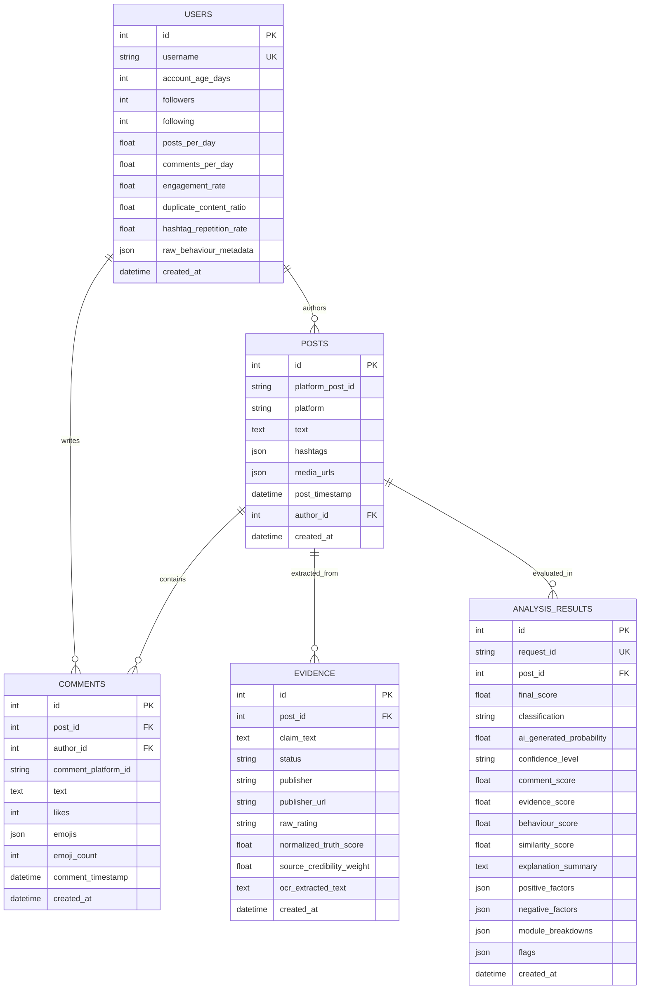

# Social Guard: Relational Database Schema & Architecture

**Project:** Social Guard: An Explainable AI Framework for Social Media Content Verification  
**Document:** DATABASE_DESIGN.md  
**ORM:** SQLAlchemy 2.0 (Asyncio)  
**Supported Databases:** PostgreSQL (Production / Development), SQLite (Fallback & Test Harness)

---

## 1. Entity-Relationship Diagram (ERD)

---

## 2. Table Specifications & Indexes

### 2.1 `users`
Stores public aggregate account metadata and behavioral features.
- **Indexes:** `ix_users_username` (Unique), `idx_users_username_followers` (Composite).

### 2.2 `posts`
Stores verified post content, attached media URLs, and platform source.
- **Indexes:** `ix_posts_platform_post_id`, `idx_posts_platform_timestamp` (Composite).

### 2.3 `comments`
Stores discussion thread comments, timestamps, and emoji arrays for NLP and temporal burst scoring.
- **Indexes:** `ix_comments_post_id`, `ix_comments_author_id`.

### 2.4 `evidence`
Stores fact-check claims, review ratings from IFCN organizations, and source weights.
- **Indexes:** `ix_evidence_post_id`, `ix_evidence_publisher`, `ix_evidence_claim_text`.

### 2.5 `analysis_results`
Stores the complete Explainable AI verification session, factor rankings, and breakdown metrics.
- **Indexes:** `ix_analysis_results_request_id` (Unique), `idx_analysis_classification_score` (Composite).
