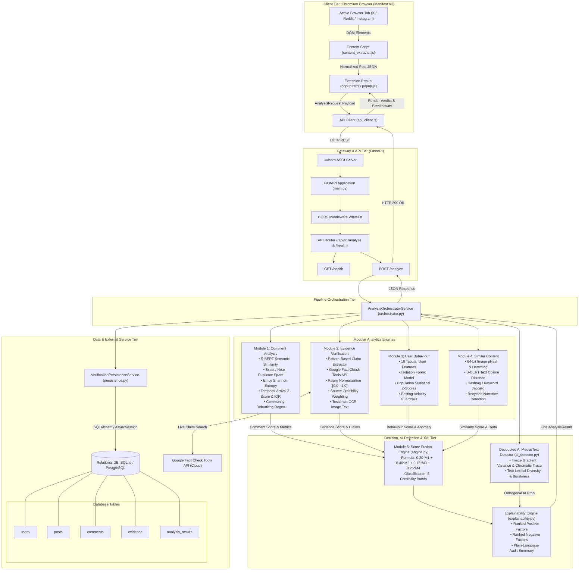

# PROJECT CONTEXT: SOCIAL GUARD

> **Document Purpose:** Complete, authoritative, ground-truth technical context specification for AI assistants, engineers, and researchers analyzing or modifying the Social Guard project.  
> **Status:** Analyzed from actual workspace source code and current implementation artifacts.

---

# 1. PROJECT OVERVIEW

- **Project Name:** Social Guard: Explainable AI Verification (also referred to as "Social Guard: An Explainable AI Framework for Social Media Content Verification")
- **One-line Description:** A multi-modal, explainable AI browser extension and FastAPI backend that assesses social media content credibility across four independent analytical vectors and detects synthetic media.
- **Detailed Purpose:** Social Guard combats viral online misinformation, astroturfed bot campaigns, coordinated spam narratives, and synthetic/AI-generated media. Rather than providing an opaque binary verdict (real vs. fake) from a single black-box neural network, Social Guard breaks verification down into four modular analytical vectors (comment discussion dynamics, external factual evidence verification, author behavioral anomaly detection, and historical narrative/visual recycling) plus an orthogonal, decoupled AI generation detector. It produces transparent, human-auditable credibility scores (0–100), factor rankings, and explanations for end users.
- **Problem Being Solved:** 
  1. Social media platforms suffer from the viral spread of unverified claims, fabricated narratives, and recycled historical media stripped of context.
  2. Users lack real-time, in-situ verification tools directly inside browser workflows.
  3. Existing automated fact-checking systems operate as black boxes without explainability, offering no diagnostic audit trail for why content was flagged.
  4. Most tools conflate *synthetic/AI generation* with *factual falsehood*, failing to distinguish factual content generated with AI tools from human-written falsehoods.
- **Target Users:**
  - Social media consumers seeking on-demand credibility analysis while browsing Twitter/X, Reddit, or Instagram.
  - Fact-checkers, open-source intelligence (OSINT) analysts, and researchers investigating viral narratives, coordinated bot networks, or recycled media.
  - Academic evaluators testing multi-vector Explainable AI (XAI) credibility assessment frameworks.
- **Main Use Case:** A user browsing Twitter/X, Reddit, or Instagram clicks the Social Guard extension icon on an active post. The extension extracts the visible post body, author metadata, attached media URLs, and comments directly from the DOM, submits them to the local backend, and within seconds renders a 5-tier credibility classification, a 0–100 credibility score, individual module breakdowns, fact-checked claim reviews with direct publisher links, an independent AI generation probability, and ranked positive/negative explanations.
- **Current MVP Status:** **Functional MVP (Phase 1–6 Complete)**. The core pipeline is fully implemented and operational locally.
  - Backend: FastAPI async server with full analytical pipelines for Modules 1–5, decoupled AI detection, explainability generation, and SQLite/PostgreSQL persistence.
  - Frontend: Manifest V3 Chrome Extension featuring Live Browser Tab Extraction (Twitter/X, Reddit, Instagram, Generic web fallback) and an Academic Demo Mode with 3 pre-configured scenarios ("Likely Real", "Uncertain", "Likely Fake").
  - Database: Relational schema using SQLAlchemy 2.0 with automatic table creation, saving users, posts, comments, evidence, and complete analysis result records.
  - External Integration: Live Google Fact Check Tools API client with fallback to neutral baselines when keys are missing or unindexed.
- **What the Application Currently Does:**
  1. Captures DOM elements from the active browser tab via `content_extractor.js` or loads pre-baked academic test cases in `popup.js`.
  2. Submits structured JSON payloads to `POST /analyze`.
  3. Executes Module 1: NLP comment analysis (S-BERT cosine similarity, exact duplication ratio, emoji Shannon entropy, temporal arrival Z-scores/IQR, and community debunking regex signals).
  4. Executes Module 2: Rule-based claim extraction, live Google Fact Check API queries, textual rating normalization, source authority weighting, and optional Tesseract OCR for text embedded in images.
  5. Executes Module 3: Vectorized author profile feature extraction and anomaly detection using a pre-trained scikit-learn `IsolationForest` model alongside statistical Z-scores and rule penalties.
  6. Executes Module 4: Perceptual image hashing (`ImageHash` pHash), keyword/hashtag Jaccard overlap, and Sentence-BERT semantic similarity against an in-memory historical corpus to detect recycled narratives.
  7. Executes Module 5: Linear weighted fusion (`0.20*M1 + 0.40*M2 + 0.15*M3 + 0.25*M4`) mapped into 5 standardized credibility bands.
  8. Evaluates decoupled AI-generation probability using gradient variance and color channel covariance for images, or lexical diversity/burstiness for text.
  9. Compiles factor rankings and human-readable diagnostic summaries through the Explainability Engine (`explainability.py`).
  10. Persists session records to SQLite (`social_guard.db`) and renders all results in the Chrome Extension popup.

---

# 2. TECHNOLOGY STACK

### Core Frameworks & Languages
- **Programming Languages:**
  - **Python (3.10+)**: Backend application logic, machine learning pipelines, REST endpoints, database ORM models, test suite.
  - **JavaScript (ES6+ Vanilla, Modern Modules)**: Chrome Extension Manifest V3 background service worker, DOM content extraction, popup interface logic, and HTTP client.
  - **HTML5 & CSS3**: Extension popup presentation layer (`popup.html`, `popup.css`).
- **Backend Framework:**
  - **FastAPI (>=0.110.0)**: High-performance asynchronous REST API framework (`backend/app/main.py`).
  - **Uvicorn (>=0.28.0)**: ASGI production-grade web server runner (`uvicorn[standard]`).
  - **Starlette**: Underpins FastAPI routing, exception handling, and middleware.
- **Frontend / Client Platform:**
  - **Google Chrome Extension (Manifest V3)**: Client architecture operating inside Chromium browsers (`extension/manifest.json`).
  - **Vanilla JavaScript & CSS**: Zero-dependency UI (no React, Vue, or Tailwind) ensuring lightweight, instantaneous popup loading.

### Database & Persistence
- **SQLAlchemy (>=2.0.28)**: Modern async relational ORM (`backend/app/db/session.py`, `models.py`).
- **aiosqlite (>=0.20.0)**: Asynchronous SQLite driver used for local development and testing (`sqlite+aiosqlite:///./social_guard.db`).
- **asyncpg (>=0.29.0) & psycopg2-binary (>=2.9.9)**: Async/sync PostgreSQL drivers for production database deployments.

### Machine Learning, NLP & Computer Vision
- **Sentence-Transformers (>=2.5.0)**: Semantic text embedding generation using `all-MiniLM-L6-v2` (`backend/app/modules/comment_analysis/similarity.py`).
- **PyTorch (>=2.2.0)**: Underlying deep learning engine for tensor operations and transformer inference.
- **Scikit-Learn (>=1.4.0)**: Isolation Forest unsupervised anomaly detection (`backend/app/modules/user_behaviour/anomaly_detector.py`) and pairwise cosine distance matrices.
- **NumPy (>=1.26.0)**: Array operations, histogram analysis, statistical IQR, and Z-score calculations.
- **ImageHash (>=4.3.1)**: 64-bit Perceptual Hashing (pHash) and bitwise Hamming distance computation (`backend/app/modules/similar_content/perceptual_hash.py`).
- **Pillow / PIL (>=10.2.0)**: Image decoding, color channel matrix conversions, and preprocessing.
- **pytesseract (>=0.3.10)**: Optical Character Recognition (OCR) wrapper to extract text from images (`backend/app/modules/evidence_verification/ocr.py`).
- **emoji (>=2.10.1)**: Emoji parsing and frequency distribution extraction (`backend/app/modules/comment_analysis/preprocessing.py`).
- **BeautifulSoup4 (>=4.12.0)**: HTML parsing for server-side Reddit DOM extraction (`backend/app/platform/reddit_extractor.py`).

### Validation & Configuration
- **Pydantic (>=2.6.0)**: Request and response validation, data parsing, strict typing (`backend/app/schemas/domain_models.py`).
- **Pydantic-Settings (>=2.2.0)**: Environment variable parsing and `.env` configuration file management (`backend/app/config.py`).
- **python-dotenv (>=1.0.1)**: Loading local environment variables into OS environment.

### Networking & HTTP Clients
- **HTTPX (>=0.27.0)**: Asynchronous HTTP client with connection pooling for Google Fact Check API queries and safe media fetching (`backend/app/modules/evidence_verification/factcheck_client.py`, `backend/app/utils/security.py`).
- **Native Browser Fetch API**: Utilized in `extension/popup/api_client.js` with `AbortController` timeouts and automated retries.

### Testing & Code Quality
- **pytest (>=8.0.0)** & **pytest-asyncio (>=0.23.5)**: Asynchronous unit, module, and integration test execution (`backend/tests/`).
- **pytest-cov (>=4.1.0)**: Test coverage measurement.
- **Black (>=24.2.0)** & **Flake8 (>=7.0.0)**: Python code formatting and linting.

### External Services
- **Google Fact Check Tools API (`claims:search`)**: Official external Google API used to retrieve verified fact-check reviews from international organizations (Snopes, Reuters, PolitiFact, AP, etc.). Requires an API key or falls back gracefully.

---

# 3. PROJECT STRUCTURE

```
d:\Social-gaurd\
├── .gitignore                         # Git exclusion rules
├── ALGORITHMS.md                      # Comprehensive mathematical & algorithmic documentation
├── API_DOCUMENTATION.md               # API endpoint specifications and schema contracts
├── ARCHITECTURE.md                    # System architecture design document
├── DATABASE_DESIGN.md                 # Relational schema and ER model documentation
├── EVALUATION_REPORT.md               # Benchmarking metrics, accuracy, precision, and latency report
├── README.md                          # High-level project summary and quickstart guide
├── SECURITY_PRIVACY.md                # Threat modeling, SSRF safeguards, and privacy controls
├── USER_GUIDE.md                      # End-user testing and verification walkthrough
├── social_guard.db                    # Root SQLite development database file
│
├── backend/                           # FASTAPI BACKEND SUBSYSTEM
│   ├── .env                           # Local environment configuration file (Ignored in git)
│   ├── .env.example                   # Environment configuration template
│   ├── requirements.txt               # Complete Python package dependencies
│   ├── social_guard.db                # Backend local runtime SQLite database
│   │
│   ├── app/                           # Core Application Package
│   │   ├── __init__.py                # Package root
│   │   ├── config.py                  # Pydantic Settings and security validation
│   │   ├── main.py                    # FastAPI application factory, lifespan, CORS, error handlers
│   │   │
│   │   ├── api/                       # API Routing Layer
│   │   │   ├── __init__.py
│   │   │   └── v1/
│   │   │       ├── router.py          # Aggregator router for v1 endpoints
│   │   │       └── endpoints/
│   │   │           ├── analyze.py     # POST /analyze endpoint definition
│   │   │           └── health.py      # GET /health endpoint definition
│   │   │
│   │   ├── db/                        # Database Management
│   │   │   ├── __init__.py
│   │   │   ├── models.py              # SQLAlchemy database tables (User, Post, Comment, Evidence, Result)
│   │   │   └── session.py             # Async engine, sessionmaker, and table initialization
│   │   │
│   │   ├── modules/                   # Analytical & Machine Learning Engines
│   │   │   ├── comment_analysis/      # MODULE 1: COMMENT DYNAMICS & CROWDSOURCED SIGNALS
│   │   │   │   ├── analyzer.py        # M1 pipeline: duplicate, semantic, emoji, burst, debunk regex
│   │   │   │   ├── preprocessing.py   # Text normalization, emoji extraction, Shannon entropy
│   │   │   │   ├── similarity.py      # S-BERT embeddings, cosine similarity, LRU cache
│   │   │   │   └── temporal.py        # Arrival rates, 1-min binning, Z-scores, IQR burst detection
│   │   │   │
│   │   │   ├── evidence_verification/ # MODULE 2: FACT-CHECK & EVIDENCE VERIFICATION
│   │   │   │   ├── analyzer.py        # M2 pipeline: query variation, fact-check retrieval, scoring
│   │   │   │   ├── claim_extractor.py # Rule-based claim extraction, greeting/opinion filtering
│   │   │   │   ├── factcheck_client.py# Async HTTP client for Google Fact Check Tools API
│   │   │   │   ├── normalization.py   # Text rating mapping to [0.0-1.0] and publisher credibility
│   │   │   │   └── ocr.py             # Pytesseract OCR image text extraction
│   │   │   │
│   │   │   ├── user_behaviour/        # MODULE 3: AUTHOR BEHAVIORAL ANOMALY DETECTION
│   │   │   │   ├── analyzer.py        # M3 pipeline: scoring, rule penalties, explanation generation
│   │   │   │   ├── anomaly_detector.py# Isolation Forest model training and statistical scoring
│   │   │   │   └── feature_extractor.py# 10 tabular feature vectors, log scaling, imputation
│   │   │   │
│   │   │   ├── similar_content/       # MODULE 4: HISTORICAL RECYCLING & TEMPORAL PROVENANCE
│   │   │   │   ├── analyzer.py        # M4 pipeline: pHash distance, S-BERT comparison, recycling flag
│   │   │   │   ├── content_repository.py# In-memory historical corpus (known viral templates & hoaxes)
│   │   │   │   ├── hashtag_keyword.py # Hashtag/keyword token extraction and Jaccard similarity
│   │   │   │   └── perceptual_hash.py # 64-bit pHash computation and Hamming distance converter
│   │   │   │
│   │   │   └── score_fusion/          # MODULE 5, AI DETECTION & EXPLAINABILITY (XAI)
│   │   │       ├── ai_detector.py     # Decoupled image gradient/chromatic variance & text diversity
│   │   │       ├── engine.py          # Linear weighted score fusion and 5-tier classification
│   │   │       └── explainability.py  # Factor ranking (positive/negative) and plain-text summaries
│   │   │
│   │   ├── platform/                  # Server-Side Platform Parsers
│   │   │   ├── __init__.py
│   │   │   ├── base.py                # Abstract BasePlatformExtractor interface
│   │   │   └── reddit_extractor.py    # BeautifulSoup HTML parser for Reddit threads
│   │   │
│   │   ├── schemas/                   # Pydantic Schemas & Data Contracts
│   │   │   ├── __init__.py
│   │   │   ├── domain_models.py       # Primary domain models (AnalysisRequest, FinalAnalysisResult)
│   │   │   ├── request.py             # Alternative request schemas
│   │   │   └── response.py            # Legacy/alternative response models
│   │   │
│   │   ├── services/                  # Business Logic & Orchestration
│   │   │   ├── __init__.py
│   │   │   ├── orchestrator.py        # End-to-end pipeline orchestrator (M1->M2->M3->M4->M5->DB)
│   │   │   └── persistence.py         # Relational database persistence service
│   │   │
│   │   └── utils/                     # Cross-Cutting Infrastructure Utilities
│   │       ├── __init__.py
│   │       ├── exceptions.py          # Custom domain exceptions (SocialGuardException)
│   │       ├── logging.py             # Centralized Python logger configuration
│   │       └── security.py            # SSRF protection, IP subnet validation, safe image fetching
│   │
│   └── tests/                         # Comprehensive Pytest Suite
│       ├── conftest.py                # Pytest fixtures, mock DB engines, client configurations
│       ├── test_analyze.py            # Integration tests for POST /analyze endpoint
│       ├── test_correctness_trace.py  # Ground truth and edge case correctness assertions
│       ├── test_db.py                 # Database persistence and model relationship tests
│       ├── test_domain_models.py      # Pydantic schema validation tests
│       ├── test_health.py             # Health check endpoint test
│       ├── test_security.py           # SSRF blocking, IP subnet parsing, sanitization tests
│       ├── test_system_scenarios.py   # Full simulated system verification scenarios
│       ├── test_ui_presets.py         # Extension preset payload compatibility tests
│       ├── test_modules/              # Unit tests for individual engines (M1 to M5, AI, XAI)
│       └── test_platform/             # Unit tests for Reddit extractor
│
├── extension/                         # CHROME EXTENSION (MANIFEST V3)
│   ├── manifest.json                  # Manifest V3 permissions, content scripts, and action config
│   ├── assets/                        # Extension icon assets (.gitkeep)
│   ├── background/
│   │   └── service_worker.js          # MV3 service worker handling lifecycle and ping messages
│   ├── content/
│   │   └── content_extractor.js       # High-precision DOM parser for Twitter, Reddit, Instagram, web
│   ├── popup/
│   │   ├── api_client.js              # Fetch client with timeouts, offline detection, and retries
│   │   ├── popup.html                 # Main extension popup interface markup
│   │   └── popup.js                   # Extension controller, state management, preset loader, UI rendering
│   └── styles/
│       └── popup.css                  # Modern dark-mode UI theme with status bands, badges, and progress bars
│
├── datasets/                          # Evaluation and Benchmark Datasets
│   ├── processed/
│   │   └── evaluation_dataset.json    # Standardized 50-item evaluation dataset with ground truth
│   ├── raw/                           # Raw collected datasets
│   └── sample/
│       └── sample_posts.json          # Example test payloads
│
├── docs/                              # Project Documentation
│   └── ENVIRONMENT_SETUP.md           # Instructions for virtualenv, Tesseract, and API keys
│
└── scripts/                           # Tooling & Evaluation Automation
    ├── lint.sh                        # Shell script to run flake8 and black
    └── run_evaluation.py              # Automated evaluation runner computing accuracy, F1, confusion matrices
```

---

# 4. FRONTEND

### Architecture Overview
The frontend is implemented entirely as a **Google Chrome Extension (Manifest V3)** located in the `extension/` directory. There is no separate multi-page React or Next.js web application. The frontend consists of a single rich popup interface (`popup.html`), an injected content script (`content_extractor.js`), a background service worker (`service_worker.js`), an API client module (`api_client.js`), and a controller (`popup.js`).

### Detailed Screen Specification: Extension Popup (`popup.html`)

- **Screen / View Name:** Social Guard Credibility Popup
- **Route / Window Context:** Chrome Extension Action Popup (`chrome-extension://<id>/popup/popup.html`)
- **Dimensions:** Fixed extension window (`width: 410px`, `max-height: 590px`, scrollable)
- **Purpose:** Serve as the user interface to inspect live web posts, run verification against the backend, switch into academic demonstration mode, view progress, and read detailed factor breakdowns.
- **Main Components:**
  1. *Header Bar*: Shield icon, brand title, subtitle, and live backend connectivity status pill (`#backend-status-badge`).
  2. *Operation Mode Selector*: Tabs to toggle between **Real Post Mode** (`#mode-real-btn`) and **Demo Mode** (`#mode-demo-btn`).
  3. *Academic Demo Toolbar*: Sub-toolbar visible only in Demo Mode with buttons for "Likely Real", "Uncertain", and "Likely Fake" test scenarios (`#demo-presets-container`).
  4. *Input & Extraction Header*: Shows target post text input (`#post-text-input`), a live content origin badge (`#content-source-badge`), and a manual "Extract from Tab" button (`#extract-page-btn`).
  5. *Extracted Metadata Strip*: Five metadata chips displaying detected Platform, Author handle, Comments count, Attached Media count, and Engagement likes (`.meta-row`).
  6. *Action Button*: Primary verification trigger (`#run-verify-btn`).
  7. *Animated Pipeline Stepper*: Five-stage animated progress indicator displayed during analysis (`#loading-spinner`).
  8. *Categorized Error Container*: Contextual error box displaying category, message, and actionable troubleshooting tips (`#error-box`).
  9. *Results Container* (`#results-container`):
     - *Post Information Card*: Platform badge, author handle, link to original source post, text preview, and metadata chips.
     - *Primary Verdict Banner*: Standardized 5-tier classification badge (`#classification-badge`) and large numeric credibility score out of 100 (`#credibility-score-val`).
     - *AI Generation Card*: Decoupled metric showing AI generation probability percentage (`#ai-probability-val`) marked explicitly as orthogonal.
     - *Modular Results List*: Four horizontal progress bars with individual numeric scores and status badges for Comments, Evidence, User Behaviour, and Similar Content.
     - *Why Did Social Guard Give This Result? (XAI Section)*: Summary explanation paragraph and dynamic list of ranked positive (green check) and negative (red warning) factors.
     - *Community & Comment Fact-Check Card*: Shows whether commenters debunked, contested, or verified the claim, including excerpts of skeptical comments.
     - *Evidence & Fact-Checks Card*: Shows list of specific factual claims extracted and individual fact-check review cards (publisher, rating, URL link).
     - *Similar Content Card*: Displays historical narrative matches or confirms originality against the local corpus.

### UI Workflows & User Actions
1. **Popup Opening**: User clicks extension icon. `popup.js` fires `DOMContentLoaded`, immediately pings `GET /health` to update `#backend-status-badge`, and automatically sends `EXTRACT_CURRENT_POST` to the active browser tab.
2. **Auto-Extraction**: `content_extractor.js` parses the page DOM. If valid post data is found, `#post-text-input` is populated, metadata chips are updated, and the mode is locked to Real Post Mode.
3. **Manual Extraction**: User clicks "Extract from Tab" (`#extract-page-btn`) if the page finished loading after popup open.
4. **Triggering Verification**: User clicks "Analyze & Verify Content" (`#run-verify-btn`).
5. **Loading Sequence**: Input form dims; `#loading-spinner` activates. Step pills advance sequentially (1: Extracting post -> 2: Checking claims -> 3: Analysing comments -> 4: Checking similar content -> 5: Generating result) with simulated timing matching backend operations.
6. **Result Display**: Spinner hides, `#results-container` reveals, and all sub-sections are rendered with color-coded classification classes.
7. **Demo Mode Toggle**: User clicks "Demo Mode" tab. Input switches to test scenarios; clicking "Likely Real", "Uncertain", or "Likely Fake" fills pre-constructed mock objects into active memory and updates metadata chips without needing a live social media tab.

### State Management
Managed via modular ES6 module-level state variables in `popup.js`:
- `currentMode`: String enum (`"real"` or `"preset"`).
- `rawExtractedData`: Stores raw DOM extraction dictionary from `content_extractor.js`.
- `activePayload`: Validated Pydantic-compatible `AnalysisRequest` payload ready for dispatch.
- `stepTimer`: Interval handle controlling the animated loading step stepper.

### API Calls from Frontend
- `GET http://localhost:8000/health`: Verifies backend connectivity; returns service name and version.
- `POST http://localhost:8000/analyze`: Sends `activePayload` containing post text, platform, media URLs, author, and comments.

### Loading States & Error Handling
- **Loading State:** 5-step animated visual progress track with active pulse animations (`.step-pill.active`).
- **Error Handling:** Categorized into four visual states:
  1. *Backend Offline*: Triggered on fetch rejection; displays helpful command: `uvicorn app.main:app --reload`.
  2. *Timeout Error*: Triggered after 30-second `AbortController` cutoff.
  3. *Validation Error*: Formatted list of schema field rejections.
  4. *Extraction Error*: Prompt informing user that the active tab is not an open tweet, Reddit thread, or Instagram modal.

---

# 5. BACKEND

### Architecture & Entrypoint
- **Entrypoint:** `backend/app/main.py`
- **Application Factory:** `create_application()` creates the FastAPI instance with lifecycle management (`lifespan`), CORS middleware, routes, and custom exception handlers.
- **Server Startup Routine (`lifespan`):**
  1. Calls `await init_db_tables()` to create missing SQLite/PostgreSQL tables.
  2. Executes Sentence-BERT model warmup in a worker thread (`asyncio.to_thread`) using a dummy string (`"Social Guard Warmup Text"`) to eliminate cold-start latency on the first user request.
- **Middleware:** `CORSMiddleware` configured with origins whitelist (`localhost:3000`, `localhost:8000`, `127.0.0.1:8000`), regex matcher for `chrome-extension://[a-zA-Z0-9]+`, and allowed methods `GET, POST, OPTIONS`.
- **Router Mounting:** Routers are included under both `/api/v1` and the root path `/` for full client backward compatibility.

### Endpoints Specification

---

#### Endpoint 1: Health Check
- **METHOD:** `GET`
- **ENDPOINT:** `/health` (also accessible via `/api/v1/health`)
- **PURPOSE:** Service health and readiness verification.
- **REQUEST BODY:** None
- **QUERY PARAMETERS:** None
- **PATH PARAMETERS:** None
- **AUTHENTICATION:** None (Public)
- **RESPONSE (`HTTP 200 OK`):**
  ```json
  {
    "status": "ok",
    "service": "social-guard",
    "version": "0.1.0"
  }
  ```
- **ERROR RESPONSES:** None under normal operation.
- **FILES INVOLVED:**
  - `backend/app/api/v1/endpoints/health.py`
  - `backend/app/schemas/response.py`
- **FRONTEND COMPONENTS USING IT:**
  - `extension/popup/api_client.js` (`SocialGuardApiClient.checkHealth()`)
  - `extension/popup/popup.js` (invoked upon popup initialization)

---

#### Endpoint 2: Social Media Post Verification & Analysis
- **METHOD:** `POST`
- **ENDPOINT:** `/analyze` (also accessible via `/api/v1/analyze`)
- **PURPOSE:** Ingests post content, author metadata, media, and comments. Executes all 5 analytical engines, decoupled AI detection, explainability generation, and database persistence.
- **REQUEST BODY:** `AnalysisRequest` (JSON)
  ```json
  {
    "request_id": "sg_real_1710000000_a1b2c3d4",
    "post": {
      "post_id": "1888223344",
      "platform": "twitter",
      "text": "NASA rovers confirm detection of subsurface water ice reserves on Mars.",
      "hashtags": ["#Space", "#Mars"],
      "media": [
        {
          "url": "https://example.com/image.png",
          "media_type": "image",
          "ocr_extracted_text": null,
          "perceptual_hash": null
        }
      ],
      "timestamp": "2026-09-10T09:00:00Z",
      "author": {
        "username": "science_reporter",
        "account_age_days": 1400,
        "followers": 24000,
        "following": 380,
        "posts_per_day": 2.2,
        "comments_per_day": 3.5,
        "engagement_rate": 0.045,
        "duplicate_content_ratio": 0.01,
        "hashtag_repetition_rate": 0.08
      },
      "comments": [
        {
          "comment_id": "c_1",
          "text": "Incredible discovery if confirmed! 🚀",
          "timestamp": "2026-09-10T09:10:00Z",
          "author_id": "astronomy_fan",
          "likes": 12,
          "emojis": ["🚀"],
          "emoji_count": 1
        }
      ]
    },
    "custom_weights": null
  }
  ```
- **QUERY PARAMETERS:** None
- **PATH PARAMETERS:** None
- **AUTHENTICATION:** None (Public)
- **RESPONSE (`HTTP 200 OK`):** `FinalAnalysisResult` (JSON)
  ```json
  {
    "request_id": "sg_real_1710000000_a1b2c3d4",
    "consolidated_score": 82.50,
    "classification": "LIKELY REAL",
    "ai_generation_probability": 0.1250,
    "explanation": "This post is classified as LIKELY REAL based on high factual evidence and verified community discussion.",
    "module_scores": {
      "comment_analysis": 85.0,
      "evidence_verification": 95.0,
      "user_behaviour": 88.0,
      "similar_content": 85.0
    },
    "module_results": {
      "timings_ms": {
        "comment_analysis_ms": 15.2,
        "evidence_verification_ms": 120.4,
        "user_behaviour_ms": 4.1,
        "similar_content_ms": 18.3,
        "score_fusion_ms": 0.08,
        "explainability_ms": 0.5,
        "total_pipeline_ms": 165.2
      },
      "module_breakdowns": {
        "comments": {
          "score": 85.0,
          "status": "COMPLETED",
          "metrics": {
            "comment_count": 1,
            "duplicate_ratio": 0.0,
            "average_similarity": 0.0,
            "emoji_entropy": 0.0,
            "temporal_anomaly_score": 0.0
          },
          "fact_check": {
            "verdict": "ORGANIC_DISCUSSION",
            "debunk_ratio": 0.0,
            "support_ratio": 0.0
          },
          "flags": []
        },
        "evidence": {
          "score": 95.0,
          "status": "SUPPORTED",
          "claims": ["NASA rovers confirm detection of subsurface water ice reserves on Mars"],
          "fact_checks": [
            {
              "claim": "NASA discovered subsurface ice on Mars",
              "publisher": "Reuters Fact Check",
              "rating": "True",
              "raw_rating": "True",
              "source_url": "https://www.reuters.com/fact-check/...",
              "normalized_truth_score": 1.0,
              "source_credibility": 1.0
            }
          ],
          "flags": ["VERIFIED_BY_FACT_CHECKERS"],
          "explanation": "Extracted claim is verified and supported by Reuters Fact Check (True)."
        },
        "user_behaviour": {
          "score": 88.0,
          "status": "COMPLETED",
          "anomaly_score": 0.05,
          "metrics": {
            "is_anomalous": false,
            "follower_following_ratio": 63.15
          },
          "flags": [],
          "explanation": "Account 'science_reporter' exhibits mature, balanced engagement patterns."
        },
        "similarity": {
          "score": 85.0,
          "status": "NO_HISTORICAL_MATCH",
          "recycled_content": false,
          "flags": ["LIMITED_LOCAL_CORPUS_EVALUATED"]
        },
        "fusion": {
          "final_score": 82.50,
          "classification": "LIKELY REAL",
          "confidence_level": "HIGH",
          "confidence_interval": [78.5, 86.5],
          "weights_applied": {
            "comment_score": 0.20,
            "evidence_score": 0.40,
            "behaviour_score": 0.15,
            "similarity_score": 0.25
          }
        }
      },
      "explainability": {
        "summary": "This post is classified as LIKELY REAL...",
        "positive_factors": [
          {
            "factor": "Evidence strongly supports the claim (verified by Reuters Fact Check: 'True').",
            "module": "evidence_verification",
            "impact_weight": 0.40
          }
        ],
        "negative_factors": [],
        "confidence_notes": []
      },
      "ai_detection": {
        "media_ai_detection": {
          "ai_generation_probability": 12.5,
          "confidence": "MEDIUM",
          "metrics": { "gradient_variance": 2187.5 }
        }
      },
      "flags": ["VERIFIED_BY_FACT_CHECKERS"]
    },
    "created_at": "2026-09-10T09:00:01.123456Z"
  }
  ```
- **ERROR RESPONSES:**
  - `HTTP 422 Unprocessable Entity`: Body payload failed schema validation (e.g. text missing or invalid types).
  - `HTTP 500 Internal Server Error`: Unhandled server exception.
- **FILES INVOLVED:**
  - `backend/app/api/v1/endpoints/analyze.py`
  - `backend/app/services/orchestrator.py`
  - `backend/app/services/persistence.py`
  - `backend/app/modules/*`
- **FRONTEND COMPONENTS USING IT:**
  - `extension/popup/api_client.js` (`SocialGuardApiClient.analyzePost()`)
  - `extension/popup/popup.js` (`handleRunVerification()`)

---

# 6. DATABASE

### Database Technology
- **Engine:** Relational Database via SQLAlchemy 2.0.
- **Default Development Engine:** **SQLite** via `aiosqlite` (`sqlite+aiosqlite:///./social_guard.db`).
- **Production Engine:** **PostgreSQL** via `asyncpg` / `psycopg2-binary` (configured via `DATABASE_URL` environment variable).
- **Session Management:** Async scoped sessions through `async_sessionmaker(bind=engine, class_=AsyncSession, expire_on_commit=False)` with automatic rollback on error.

### Database Tables & Schema Models

#### 1. `users` Table (`UserModel`)
- **Purpose:** Stores author profiles and historical behavioral tracking data.
- **Fields:**
  - `id`: `Integer`, Primary Key, autoincrement, indexed.
  - `username`: `String(150)`, unique, indexed, non-nullable.
  - `account_age_days`: `Integer`, nullable.
  - `followers`: `Integer`, non-nullable, default `0`.
  - `following`: `Integer`, non-nullable, default `0`.
  - `posts_per_day`: `Float`, nullable, default `0.0`.
  - `comments_per_day`: `Float`, nullable, default `0.0`.
  - `engagement_rate`: `Float`, nullable.
  - `duplicate_content_ratio`: `Float`, nullable.
  - `hashtag_repetition_rate`: `Float`, nullable.
  - `raw_behaviour_metadata`: `JSON`, nullable, default `{}`.
  - `created_at`: `DateTime(timezone=True)`, non-nullable, default UTC now.
- **Relationships:**
  - `posts`: 1-to-many with `posts` (`PostModel.author`), cascade delete.
  - `comments`: 1-to-many with `comments` (`CommentModel.author`).
- **Indexes:** `idx_users_username_followers` on `(username, followers)`.
- **Read/Written by:** Written and queried by `VerificationPersistenceService.get_or_create_user()`.

#### 2. `posts` Table (`PostModel`)
- **Purpose:** Records analyzed social media posts.
- **Fields:**
  - `id`: `Integer`, Primary Key, autoincrement, indexed.
  - `platform_post_id`: `String(100)`, indexed, nullable.
  - `platform`: `String(50)`, non-nullable, default `"generic"`, indexed.
  - `text`: `Text`, non-nullable.
  - `hashtags`: `JSON`, non-nullable, default `[]`.
  - `media_urls`: `JSON`, non-nullable, default `[]`.
  - `post_timestamp`: `DateTime(timezone=True)`, nullable.
  - `author_id`: `Integer`, Foreign Key (`users.id`, `ondelete="SET NULL"`), nullable, indexed.
  - `created_at`: `DateTime(timezone=True)`, non-nullable, default UTC now.
- **Relationships:**
  - `author`: Many-to-1 with `UserModel`.
  - `comments`: 1-to-many with `CommentModel`, cascade delete.
  - `evidence_items`: 1-to-many with `EvidenceModel`, cascade delete.
  - `analysis_results`: 1-to-many with `AnalysisResultModel`, cascade delete.
- **Indexes:** `idx_posts_platform_timestamp` on `(platform, post_timestamp)`.
- **Read/Written by:** Written by `VerificationPersistenceService.save_verification_session()`.

#### 3. `comments` Table (`CommentModel`)
- **Purpose:** Stores individual comments associated with an analyzed post.
- **Fields:**
  - `id`: `Integer`, Primary Key, autoincrement, indexed.
  - `post_id`: `Integer`, Foreign Key (`posts.id`, `ondelete="CASCADE"`), non-nullable, indexed.
  - `author_id`: `Integer`, Foreign Key (`users.id`, `ondelete="SET NULL"`), nullable, indexed.
  - `comment_platform_id`: `String(100)`, nullable.
  - `text`: `Text`, non-nullable.
  - `likes`: `Integer`, non-nullable, default `0`.
  - `emojis`: `JSON`, non-nullable, default `[]`.
  - `emoji_count`: `Integer`, non-nullable, default `0`.
  - `comment_timestamp`: `DateTime(timezone=True)`, nullable.
  - `created_at`: `DateTime(timezone=True)`, non-nullable, default UTC now.
- **Relationships:**
  - `post`: Many-to-1 with `PostModel`.
  - `author`: Many-to-1 with `UserModel`.
- **Read/Written by:** Written by `VerificationPersistenceService.save_verification_session()`.

#### 4. `evidence` Table (`EvidenceModel`)
- **Purpose:** Stores extracted factual claims and matched fact-checks from external organizations.
- **Fields:**
  - `id`: `Integer`, Primary Key, autoincrement, indexed.
  - `post_id`: `Integer`, Foreign Key (`posts.id`, `ondelete="CASCADE"`), non-nullable, indexed.
  - `claim_text`: `Text`, non-nullable, indexed.
  - `status`: `String(50)`, non-nullable, default `"NO_FACT_CHECK_FOUND"`.
  - `publisher`: `String(150)`, nullable, indexed.
  - `publisher_url`: `String(500)`, nullable.
  - `raw_rating`: `String(100)`, nullable.
  - `normalized_truth_score`: `Float`, nullable.
  - `source_credibility_weight`: `Float`, nullable.
  - `ocr_extracted_text`: `Text`, nullable.
  - `raw_response_metadata`: `JSON`, nullable, default `{}` (with sensitive keys scrubbed).
  - `created_at`: `DateTime(timezone=True)`, non-nullable, default UTC now.
- **Relationships:**
  - `post`: Many-to-1 with `PostModel`.
- **Read/Written by:** Written by `VerificationPersistenceService.save_verification_session()`.

#### 5. `analysis_results` Table (`AnalysisResultModel`)
- **Purpose:** Consolidated session record storing overall credibility verdicts, intermediate scores, and XAI diagnostic trails.
- **Fields:**
  - `id`: `Integer`, Primary Key, autoincrement, indexed.
  - `request_id`: `String(100)`, unique, indexed, non-nullable.
  - `post_id`: `Integer`, Foreign Key (`posts.id`, `ondelete="CASCADE"`), non-nullable, indexed.
  - `final_score`: `Float`, non-nullable, indexed.
  - `classification`: `String(50)`, non-nullable, indexed.
  - `ai_generated_probability`: `Float`, nullable.
  - `confidence_level`: `String(20)`, non-nullable, default `"MEDIUM"`.
  - `confidence_interval_low`: `Float`, nullable.
  - `confidence_interval_high`: `Float`, nullable.
  - `comment_score`: `Float`, nullable.
  - `evidence_score`: `Float`, nullable.
  - `behaviour_score`: `Float`, nullable.
  - `similarity_score`: `Float`, nullable.
  - `explanation_summary`: `Text`, non-nullable.
  - `positive_factors`: `JSON`, non-nullable, default `[]`.
  - `negative_factors`: `JSON`, non-nullable, default `[]`.
  - `module_breakdowns`: `JSON`, non-nullable, default `{}`.
  - `flags`: `JSON`, non-nullable, default `[]`.
  - `created_at`: `DateTime(timezone=True)`, non-nullable, indexed, default UTC now.
- **Relationships:**
  - `post`: Many-to-1 with `PostModel`.
- **Indexes:** `idx_analysis_classification_score` on `(classification, final_score)`.
- **Read/Written by:** Checked for idempotency and written by `VerificationPersistenceService.save_verification_session()`.

### Complete Data Flow Diagram
```
Browser Extension (popup.js / content_extractor.js)
             │
             │ HTTP POST /analyze (JSON payload)
             ▼
FastAPI Layer (app/api/v1/endpoints/analyze.py)
             │
             │ AnalysisRequest schema validated
             ▼
Pipeline Orchestrator (app/services/orchestrator.py)
             │
             ├── M1: Comment Analysis (S-BERT, NLP, Regex)
             ├── M2: Evidence Verification (Google Fact Check API)
             ├── M3: User Behaviour (Isolation Forest)
             ├── M4: Similar Content (pHash, Historical Corpus)
             ├── M5: Score Fusion (0.20*M1 + 0.40*M2 + 0.15*M3 + 0.25*M4)
             └── M6: Decoupled AI Detector & XAI Factor Ranking
             │
             │ Analysis results & breakdowns aggregated
             ▼
Persistence Service (app/services/persistence.py)
             │
             ├── 1. Get or create author record ──> `users` table
             ├── 2. Save post metadata ──────────> `posts` table
             ├── 3. Save extracted comments ─────> `comments` table
             ├── 4. Save matched fact-checks ────> `evidence` table
             └── 5. Commit session record ───────> `analysis_results` table
             │
             ▼
JSON Response (FinalAnalysisResult) returned to Chrome Extension
```

---

# 7. AUTHENTICATION & USER ROLES

- **Authentication Mechanism:** **NONE IMPLEMENTED**. The current MVP has no user authentication.
- **Login / Signup:** ❌ Not implemented. There are no signup, login, registration, or password reset screens or endpoints.
- **Sessions / Tokens:** ❌ Not implemented. No JWT, session cookies, Bearer tokens, or API token authentication logic exists.
- **Password Handling:** ❌ Not implemented. No password hashing (`bcrypt`, `argon2`), password storage, or verification code exists.
- **User Roles & Permissions:** ❌ Not implemented. There is no concept of Admin, Moderator, Researcher, or Standard user. All requests to `/analyze` and `/health` are anonymous and unauthenticated.
- **Protected Routes:** ❌ Not implemented. Both `/health` and `/analyze` are publicly accessible.
- **Security Settings Observed in Code:**
  - `SECRET_KEY` is defined in `backend/app/config.py` (defaults to `"default-insecure-secret-key-change-me"`).
  - In `Settings.validate_security_settings()`, if `APP_ENV=production`, the application raises an error if `SECRET_KEY` has not been overridden with a custom key. However, this secret key is currently unused by any cryptographic auth handler.
  - Data scrubbing: `VerificationPersistenceService._scrub_sensitive_data()` recursively redacts keys containing `"key"`, `"secret"`, `"token"`, or `"password"` prior to database storage or logging.
- **Summary of Status:** All authentication, authorization, and multi-tenant user account features are **PLANNED / MISSING**.

---

# 8. CORE APPLICATION WORKFLOW

### Workflow 1: Live Social Media Post Verification (Real Post Mode)
1. **User opens browser tab:** User navigates to a live post on Twitter/X, Reddit, or Instagram.
2. **User opens extension:** User clicks the Social Guard extension icon in the Chrome toolbar.
3. **Popup initialization:**
   - `popup.js` fires `DOMContentLoaded`.
   - Sends `GET /health` to backend; sets status badge to "Ready" or "Offline".
   - Sends `{ action: "EXTRACT_CURRENT_POST" }` via `chrome.tabs.sendMessage` to active tab.
4. **Content script extraction:**
   - `content_extractor.js` parses the active DOM.
   - For Twitter/X: Locates focal tweet article via URL status ID, extracts text, author username, timestamp, image URLs, and reply tweets.
   - For Reddit: Locates `shreddit-post` or classic post container, extracts post title, body, author, upvotes, and comments.
   - For Instagram: Locates dialog modal or post container, extracts caption, author, and comments.
   - Returns normalized post dictionary to `popup.js`.
5. **UI Population:** `popup.js` validates data with `validateAndBuildAnalysisPayload()`, fills `#post-text-input`, and updates metadata chips (Platform, Author, Comments count, Media count).
6. **User triggers verification:** User clicks "Analyze & Verify Content" (`#run-verify-btn`).
7. **Loading state:** Input dims; `#loading-spinner` displays; sequential 5-stage progress stepper starts.
8. **Frontend sends API request:** `api_client.js` dispatches `POST /analyze` with the `AnalysisRequest` payload.
9. **Backend orchestration (`orchestrator.py`):**
   - Ingests payload and generates a unique session correlation ID (`sg_real_...`).
   - Module 1 runs: Analyzes comments for duplicate ratios, S-BERT semantic similarity, emoji Shannon entropy, temporal arrival spikes, and debunking phrases.
   - Module 2 runs: Extracts factual claims, queries Google Fact Check Tools API, normalizes publisher ratings, weights source authority, and runs OCR if images are attached.
   - Module 3 runs: Extracts author feature vector, runs Isolation Forest anomaly model, and applies rule guardrails.
   - Module 4 runs: Computes image pHash, S-BERT text similarity, and hashtag Jaccard overlap against historical corpus items to detect recycled hoaxes.
   - Module 5 runs: Applies formula `0.20*M1 + 0.40*M2 + 0.15*M3 + 0.25*M4`, assigns 5-tier classification band and confidence interval.
   - Decoupled AI Detector runs: Analyzes image gradient variance/chromatic trace or text lexical burstiness to determine synthetic generation probability.
   - Explainability Engine runs: Formulates plain-language summary and ranks contributing positive/negative factors.
   - Persistence Service runs: Inserts author, post, comments, evidence, and session record into SQLite/PostgreSQL database.
10. **Backend returns response:** Returns `FinalAnalysisResult` with HTTP 200.
11. **UI renders results:** Spinner hides; `#results-container` displays:
   - Primary classification banner and score (0–100).
   - Decoupled AI generation probability badge.
   - Four modular progress bars with granular points.
   - Plain-language explanation with ranked bullet points.
   - Community comment debunking stance.
   - Claims checked and fact-check review cards with publisher URLs.
   - Similar content historical matches.

### Workflow 2: Academic Demonstration Mode (Demo Mode)
1. User clicks "Demo Mode" tab (`#mode-demo-btn`).
2. Mode switches to `currentMode = "preset"`; test scenario toolbar displays 3 buttons: "Likely Real", "Uncertain", "Likely Fake".
3. User selects a preset (e.g. "Likely Fake" bleach cure hoax).
4. `popup.js` loads pre-configured `TEST_PRESETS.fake` into active state, updates the text input, and refreshes the metadata chips.
5. User clicks "Analyze & Verify Content".
6. Payload is submitted to `POST /analyze` exactly as in live verification.
7. Backend executes real analytical pipelines and returns the analysis result.
8. UI displays the result verdict, breakdown bars, and explanation.

---

# 9. AI / ML / COMPUTER VISION / LLM COMPONENTS

The application incorporates six distinct AI/ML and statistical components:

### Component 1: Semantic Text Similarity (Sentence-BERT)
- **Model Name:** `sentence-transformers/all-MiniLM-L6-v2`
- **Architecture:** Compact 6-layer Transformer (MiniLM) yielding 384-dimensional dense sentence embeddings.
- **Libraries:** `sentence-transformers`, `torch`, `transformers`.
- **Purpose:** 
  1. Computes pairwise semantic similarity across comments in Module 1 to detect bot co-ordination and coordinated copypasta beyond exact string matches.
  2. Computes cosine similarity between new social media post text and historical corpus records in Module 4.
- **Inference & Optimization:**
  - Loaded once as a thread-safe singleton (`get_sbert_model()`).
  - Pre-warmed during application startup (`main.py` lifespan) using dummy inference.
  - Bounded in-memory LRU cache (`_EMBEDDING_CACHE`, max 1,000 entries) prevents redundant transformer re-encoding of repeated texts.
- **Thresholds:** Similarity threshold `= 0.85` for near-duplicate comment clustering; `= 0.75` for historical narrative recycling match.

### Component 2: User Behavioral Anomaly Detection (Isolation Forest)
- **Model Name:** Isolation Forest (`sklearn.ensemble.IsolationForest`)
- **Architecture:** Unsupervised ensemble of 100 isolation trees isolating anomalies in multidimensional feature space.
- **Libraries:** `scikit-learn`, `numpy`.
- **Input Features (10-dimensional vector):**
  1. `account_age_days`: Account longevity.
  2. `followers`: Total follower count.
  3. `following`: Total following count.
  4. `follower_following_ratio`: Ratio of followers to following.
  5. `posts_per_day`: Daily posting frequency.
  6. `comments_per_day`: Daily comment frequency.
  7. `average_posting_interval_seconds`: Spacing between posts.
  8. `engagement_rate`: (likes + replies) / followers.
  9. `duplicate_content_ratio`: Proportion of identical posts in recent timeline.
  10. `hashtag_repetition_rate`: Repetition frequency of hashtags.
- **Training Baseline:** Trained at startup (`anomaly_detector.py`) on 600 synthetically generated realistic social media profiles modeling authentic population distributions (90% normal users, 10% high-activity creators).
- **Hyperparameters:** `n_estimators=100`, `contamination=0.08`, `random_state=42`.
- **Output:** Raw decision function mapped into continuous normalized anomaly score `[0.0, 1.0]`. High anomaly penalizes behavior score by up to 30 points.
- **Design Guardrail:** Anomalous behavior indicates automation or velocity anomalies; the system explicitly marks that anomaly **does not** prove content is false.

### Component 3: Optical Character Recognition (OCR)
- **Model / Engine:** Tesseract OCR via `pytesseract`.
- **Architecture:** Pre-trained LSTM-based OCR optical recognition engine.
- **Input:** Image bytes downloaded safely via `safe_fetch_image_bytes()`.
- **Output:** Cleaned plain text extracted from images or infographics.
- **Integration:** In Module 2 (`ocr.py`), extracted OCR text is appended to the post text before claim extraction so fact-checks can be queried for text inside image memes.
- **Fallback:** Gracefully skips if Tesseract binary is not installed on the host machine.

### Component 4: Perceptual Image Hashing (pHash)
- **Library / Algorithm:** `ImageHash` (Discrete Cosine Transform perceptual hash).
- **Architecture:** Converts image luminance matrix into frequency domain via DCT and extracts a 64-bit fingerprint hash.
- **Input:** Attached post images.
- **Output:** 16-character hexadecimal hash string (e.g. `"a1b2c3d4e5f60718"`).
- **Matching:** Bitwise Hamming distance computed between query image hash and historical corpus item image hashes.
- **Threshold:** Hamming distance `≤ 10` (or `≤ 6` for near-identical) flags visual recycling.

### Component 5: Synthetic Media Detection (Decoupled AI Detector)
- **Architecture:** Orthogonal evaluation module (`ai_detector.py`) assessing synthetic generation likelihood `[0.0 - 100.0]`.
- **Image Synthetic Detection:** `StatisticalImageArtifactDetector`
  - Computes high-frequency gradient magnitude variance (diffusion models produce characteristic smoothness or uniform high-frequency grid variance).
  - Computes color channel correlation matrix trace across RGB channels.
  - Generates continuous probability `[0.0 - 100.0]`.
- **Text Synthetic Detection:** `PerplexityTextAIDetector`
  - Analyzes n-gram lexical diversity (Type-Token Ratio) and sentence-length burstiness entropy.
- **Critical Design Separation:** Explicitly decoupled from credibility. AI-generated probability **never** directly alters the 0–100 credibility score.

### Component 6: External Fact-Checking Retrieval (Google Fact Check Tools API)
- **Architecture:** Asynchronous REST client querying Google's Fact Check ClaimSearch API.
- **Input:** Verifiable factual claims extracted via regex/NLP filtering in `claim_extractor.py`.
- **Normalization:** Maps heterogeneous publisher ratings ("Pants on Fire", "Mostly False", "Half True", "Verified") into standardized float `[0.0 - 1.0]` truth scores.
- **Publisher Credibility Weighting:** Weights reviews by publisher authority (1.0 for established news organizations like Reuters, AP, Snopes; 0.7 for secondary publishers).
- **Rule for Unindexed Claims:** If no reviews are found, assigns **neutral baseline 50.0** (`NO_FACT_CHECK_FOUND`). The system explicitly forbids assuming unverified claims are false.

### LLM Integration
- **LLM Usage in Current Code:** **NONE**. The project does **not** make calls to OpenAI, Claude, Gemini, or local Ollama LLMs. All summarization, claim extraction, and explainability reasoning are executed via deterministic rule engines, S-BERT embeddings, and statistical modeling.

---

# 10. FILE / IMAGE / VIDEO PROCESSING

- **Upload Process:** There is no traditional server-side multi-part file upload endpoint. Instead, the Chrome Extension extracts image URLs (`img.src` or `media_urls`) directly from target social media posts and transmits URLs to `POST /analyze`.
- **Supported File Types:** Images (`image/jpeg`, `image/png`, `image/webp`). Video and audio types are represented in enum schemas (`MediaType.VIDEO`, `MediaType.AUDIO`) but currently pass through without deep frame extraction.
- **File Validation & SSRF Guardrails (`security.py`):**
  - All URLs fetched server-side are strictly validated against Server-Side Request Forgery (SSRF).
  - Scheme must be `http` or `https`.
  - Hostnames resolving to loopback (`127.0.0.0/8`, `::1`), RFC 1918 private subnets (`10.0.0.0/8`, `172.16.0.0/12`, `192.168.0.0/16`), link-local/cloud metadata (`169.254.0.0/16`), or multicast are unconditionally blocked.
  - Maximum payload size limit: **10 MB** (`max_bytes=10_000_000`).
  - Timeout: **6.0 seconds**.
- **Processing Pipeline:**
  1. Image bytes fetched in memory (`safe_fetch_image_bytes`).
  2. Bytes passed to `Image.open(io.BytesIO(bytes))`.
  3. Perceptual hashing: `imagehash.phash(img)` generates 64-bit hash.
  4. OCR: `pytesseract.image_to_string(img)` extracts embedded text strings.
  5. AI detection: NumPy converts image to array to calculate gradient variance and color covariance.
- **Temporary Files:** None written to disk. All image operations occur strictly in-memory using `io.BytesIO`.
- **Download Functionality:** None implemented.

---

# 11. UI/UX DESIGN

Extracted directly from `extension/styles/popup.css` and `extension/popup/popup.html`:

### Color Palette (CSS Variables)
- **Backgrounds:**
  - Page Background: `#0d1117` (`--bg-page`, GitHub dark mode tone)
  - Card / Panel Background: `#161b22` (`--bg-card`)
  - Subtle / Hover Background: `#21262d` (`--bg-subtle`)
- **Borders:**
  - Subtle Border: `#30363d` (`--border-subtle`)
  - Highlight Border: `#484f58` (`--border-highlight`)
- **Typography Colors:**
  - Main Heading / Body Text: `#f0f6fc` (`--text-main`)
  - Muted Text: `#8b949e` (`--text-muted`)
  - Dim Text: `#6e7681` (`--text-dim`)
- **Accents:**
  - Electric Blue: `#58a6ff` (`--accent-blue`)
  - Soft Purple: `#bc8cff` (`--accent-purple`)
- **Verdict & Band Colors:**
  - **Likely Real (80–100):** `#3fb950`, background `rgba(63, 185, 80, 0.15)`, border `rgba(63, 185, 80, 0.4)`
  - **Probably Real (60–79):** `#56d364`, background `rgba(86, 211, 100, 0.15)`, border `rgba(86, 211, 100, 0.4)`
  - **Uncertain (40–59):** `#d29922`, background `rgba(210, 153, 34, 0.15)`, border `rgba(210, 153, 34, 0.4)`
  - **Probably Fake (20–39):** `#db6d28`, background `rgba(219, 109, 40, 0.15)`, border `rgba(219, 109, 40, 0.4)`
  - **Likely Fake (0–19):** `#f85149`, background `rgba(248, 81, 73, 0.15)`, border `rgba(248, 81, 73, 0.4)`

### Typography
- **Primary Font Family:** `-apple-system, BlinkMacSystemFont, "Segoe UI", Helvetica, Arial, sans-serif` (`--font-sans`)
- **Monospace Font Family:** `ui-monospace, SFMono-Regular, SF Mono, Menlo, Consolas, monospace` (`--font-mono`)
- **Base Font Size:** `13px` with line height `1.45`.

### Components & UI Patterns
- **Buttons:**
  - `.btn-verify`: Full-width primary CTA with vibrant gradient (`linear-gradient(135deg, #1f6feb 0%, #238636 100%)`), border radius `6px`, bold text, box-shadow on hover.
  - `.mode-tab`: Segmented pill tab buttons with subtle background and active state highlighting.
  - `.preset-btn`: Small color-coded scenario pills for instant testing.
  - `.btn-text`: Compact ghost button with blue text (`#58a6ff`) for "Extract from Tab".
- **Cards & Sections:**
  - Divided by `.section-divider` (1px solid `#30363d`) and `.divider-subtle`.
  - Cards feature rounded corners (`border-radius: 8px`), padding `12px`, and dark backgrounds (`#161b22`).
- **Progress Bars:**
  - `.track`: Background `#21262d`, height `6px`, border-radius `3px`.
  - `.bar`: Transitions smoothly with width changes (`transition: width 0.4s ease-out`).
- **Animations:**
  - `@keyframes spin`: Continuous 360-degree rotation for loading spinner.
  - `@keyframes pulse`: Subtle opacity pulse (`0.6` to `1.0`) on active loading step pills.
- **Theme Modes:** Dark mode only (built-in default dark theme optimized for readability).

---

# 12. ENVIRONMENT VARIABLES & CONFIGURATION

Extracted directly from `backend/app/config.py` and `backend/.env.example`:

| Variable Name | Purpose | Where Used | Required | Default Value |
|---|---|---|---|---|
| `APP_NAME` | Name of the FastAPI application | `app/config.py`, `app/main.py` | No | `"Social Guard API"` |
| `APP_VERSION` | Semantic version string | `app/config.py`, `app/main.py` | No | `"0.1.0"` |
| `APP_ENV` | Runtime environment mode (`development`, `testing`, `production`) | `app/config.py`, `app/main.py` | No | `"development"` |
| `DEBUG` | Enable debug logs and OpenAPI docs in production | `app/config.py`, `app/main.py` | No | `True` |
| `HOST` | HTTP server host binding | `app/config.py` | No | `"0.0.0.0"` |
| `PORT` | HTTP server port binding | `app/config.py` | No | `8000` |
| `API_V1_PREFIX` | Router prefix for versioned endpoints | `app/config.py`, `app/main.py` | No | `"/api/v1"` |
| `SECRET_KEY` | Cryptographic secret for signing (must be changed if `APP_ENV=production`) | `app/config.py` | Conditional (Prod) | `[REDACTED]` (Default: `"default-insecure-secret-key-change-me"`) |
| `ALLOWED_ORIGINS` | JSON list of allowed origins for CORS headers | `app/config.py`, `app/main.py` | No | `["http://localhost:3000", "http://localhost:8000", "http://127.0.0.1:8000"]` |
| `GOOGLE_FACT_CHECK_API_KEY` | API key to access Google Fact Check Tools API (`claims:search`) | `app/config.py`, `app/modules/evidence_verification/factcheck_client.py` | No (falls back gracefully) | `""` (Empty string) |
| `DATABASE_URL` | Async database connection URL | `app/config.py`, `app/db/session.py` | No | `"sqlite+aiosqlite:///./social_guard.db"` |
| `DATABASE_SYNC_URL` | Sync database connection URL (for migrations/tools) | `backend/.env.example` | No | `"sqlite:///./social_guard.db"` |
| `SBERT_MODEL_NAME` | Hugging Face model repository name for Sentence-BERT embeddings | `app/config.py`, `app/modules/comment_analysis/similarity.py` | No | `"all-MiniLM-L6-v2"` |
| `DEVICE` | PyTorch execution device (`cpu` or `cuda`) | `app/config.py`, `app/modules/comment_analysis/similarity.py` | No | `"cpu"` |
| `WEIGHT_COMMENTS` | Module 1 weight in score fusion | `app/config.py`, `app/modules/score_fusion/engine.py` | No | `0.20` |
| `WEIGHT_EVIDENCE` | Module 2 weight in score fusion | `app/config.py`, `app/modules/score_fusion/engine.py` | No | `0.40` |
| `WEIGHT_USER_BEHAVIOUR` | Module 3 weight in score fusion | `app/config.py`, `app/modules/score_fusion/engine.py` | No | `0.15` |
| `WEIGHT_SIMILAR_CONTENT`| Module 4 weight in score fusion | `app/config.py`, `app/modules/score_fusion/engine.py` | No | `0.25` |

---

# 13. DEPENDENCIES

Extracted from `backend/requirements.txt`:

| Package Name | Version Specifier | Purpose | Where Used |
|---|---|---|---|
| `fastapi` | `>=0.110.0` | Core asynchronous web framework | `backend/app/main.py`, router files |
| `uvicorn[standard]` | `>=0.28.0` | Production ASGI web server runner | Application entrypoint |
| `pydantic` | `>=2.6.0` | Data validation, schemas, and serialization | `backend/app/schemas/domain_models.py` |
| `pydantic-settings` | `>=2.2.0` | Environment configuration management | `backend/app/config.py` |
| `python-multipart` | `>=0.0.9` | Multipart form parsing | FastAPI dependency |
| `httpx` | `>=0.27.0` | Asynchronous HTTP client | `factcheck_client.py`, `security.py` |
| `beautifulsoup4` | `>=4.12.0` | HTML parsing for web scraping | `reddit_extractor.py` |
| `scikit-learn` | `>=1.4.0` | Isolation Forest & cosine similarity | `anomaly_detector.py`, `similarity.py` |
| `numpy` | `>=1.26.0` | Array operations, statistics, Z-score/IQR | Modules 1, 3, 4, 5, AI detector |
| `sentence-transformers`| `>=2.5.0`| Dense sentence embeddings (MiniLM) | `comment_analysis/similarity.py`, `similar_content/analyzer.py` |
| `transformers` | `>=4.38.0` | Underlying Hugging Face model architecture | Dependency for sentence-transformers |
| `torch` | `>=2.2.0` | PyTorch deep learning framework | Transformer inference backend |
| `emoji` | `>=2.10.1` | Emoji extraction & regex detection | `comment_analysis/preprocessing.py` |
| `ImageHash` | `>=4.3.1` | Perceptual image hashing (pHash) | `similar_content/perceptual_hash.py` |
| `Pillow` | `>=10.2.0` | Image reading, decoding, array conversion | `ai_detector.py`, `ocr.py`, `perceptual_hash.py` |
| `pytesseract` | `>=0.3.10` | Optical character recognition wrapper | `evidence_verification/ocr.py` |
| `sqlalchemy` | `>=2.0.28` | Relational ORM & schema definitions | `backend/app/db/` |
| `asyncpg` | `>=0.29.0` | Asynchronous PostgreSQL database driver | `backend/app/db/session.py` (when PG is used) |
| `psycopg2-binary` | `>=2.9.9` | Synchronous PostgreSQL driver | Database utilities |
| `aiosqlite` | `>=0.20.0` | Asynchronous SQLite driver | `backend/app/db/session.py` |
| `pytest` | `>=8.0.0` | Automated testing framework | `backend/tests/` |
| `pytest-asyncio` | `>=0.23.5`| Asynchronous test runner for pytest | `backend/tests/` |
| `pytest-cov` | `>=4.1.0` | Test coverage reporting | Testing scripts |
| `black` | `>=24.2.0` | Code formatter | Code quality tooling |
| `flake8` | `>=7.0.0` | Python style linter | Code quality tooling |
| `python-dotenv` | `>=1.0.1` | Local `.env` file loader | Backend configuration |

---

# 14. CURRENT FEATURES

| Feature | Status | Evidence/File | Description |
|---|---|---|---|
| Manifest V3 Chrome Extension | ✅ Fully implemented | `extension/manifest.json`, `popup.html` | Client UI running in Chrome toolbar with live tab extraction and demo tabs. |
| Twitter / X DOM Extraction | ✅ Fully implemented | `extension/content/content_extractor.js` | Parses focal status tweet text, author username, media images, and reply comments from X/Twitter DOM. |
| Reddit DOM Extraction | ✅ Fully implemented | `extension/content/content_extractor.js`, `reddit_extractor.py` | Parses `shreddit-post`, titles, selftext, upvotes, and comments from Reddit pages. |
| Instagram DOM Extraction | ✅ Fully implemented | `extension/content/content_extractor.js` | Extracts caption, post author, media URL, and visible comments from Instagram post dialogs. |
| Generic Web Post Fallback | ✅ Fully implemented | `extension/content/content_extractor.js` | Fallback extracting article content or selected text on unsupported platforms. |
| Academic Demo Mode Toolbar | ✅ Fully implemented | `extension/popup/popup.js`, `popup.html` | Instant toggle allowing offline academic testing of Likely Real, Uncertain, and Likely Fake posts. |
| Health Check API | ✅ Fully implemented | `backend/app/api/v1/endpoints/health.py` | `GET /health` endpoint returning operational status and version. |
| Content Analysis Pipeline | ✅ Fully implemented | `backend/app/api/v1/endpoints/analyze.py` | `POST /analyze` orchestrating full 5-module verification pipeline. |
| Module 1: Comment Analysis | ✅ Fully implemented | `backend/app/modules/comment_analysis/` | Exact/near duplicate detection, S-BERT semantic similarity, emoji entropy, temporal burst Z-scores, community debunk regex. |
| Module 2: Evidence Verification | ✅ Fully implemented | `backend/app/modules/evidence_verification/` | Claim extraction, Google Fact Check API querying, rating normalization, publisher weighting, neutral baseline fallback. |
| Module 3: User Behaviour Analysis | ✅ Fully implemented | `backend/app/modules/user_behaviour/` | 10 tabular feature vectorization, Isolation Forest anomaly scoring, statistical Z-scores, velocity guardrails. |
| Module 4: Similar Content Engine | ✅ Fully implemented | `backend/app/modules/similar_content/` | Image pHash distance, S-BERT text similarity, keyword/hashtag Jaccard overlap, recycled narrative detection. |
| Module 5: Score Fusion Engine | ✅ Fully implemented | `backend/app/modules/score_fusion/engine.py` | Linear weighted score fusion (`0.20*M1 + 0.40*M2 + 0.15*M3 + 0.25*M4`), 5-tier classification, confidence intervals. |
| Decoupled AI Media Detection | ✅ Fully implemented | `backend/app/modules/score_fusion/ai_detector.py` | Standalone gradient variance & chromatic covariance analysis for images, lexical burstiness for text. |
| Explainability Engine (XAI) | ✅ Fully implemented | `backend/app/modules/score_fusion/explainability.py` | Plain-language summaries, ranked positive/negative factor lists, and confidence notes. |
| Database Persistence | ✅ Fully implemented | `backend/app/services/persistence.py`, `models.py` | Relational storage of users, posts, comments, evidence, and complete analysis session records. |
| SSRF Security Protection | ✅ Fully implemented | `backend/app/utils/security.py` | Subnet filtering blocking loopback, RFC 1918 private, link-local, and cloud metadata IPs during media fetching. |
| Tesseract OCR Support | 🟡 Partially implemented | `backend/app/modules/evidence_verification/ocr.py` | Code is fully written and tested with fallback, but requires local installation of Tesseract binary on host. |
| Historical Content Database | 🟡 Partially implemented | `similar_content/content_repository.py` | In-memory repository with 3 default items; does not yet query SQLite/PostgreSQL historical tables dynamically. |
| Evaluation Benchmark Runner | ✅ Fully implemented | `scripts/run_evaluation.py`, `datasets/processed/evaluation_dataset.json` | 50-item benchmark script generating accuracy, precision, recall, and confusion matrix reports. |
| User Authentication & Accounts | ❌ Not implemented | `backend/app/main.py` | No login, signup, JWT tokens, session cookies, or access control. |
| User Roles & Admin Dashboard | ❌ Not implemented | `backend/app/main.py` | No administrative panel or permission hierarchy. |
| Video Deepfake Frame Analysis | ❌ Not implemented | `ai_detector.py` | Video media type is represented in schema, but video files are not unpacked into frames for temporal deepfake analysis. |

---

# 15. CURRENT LIMITATIONS / BUGS

1. **In-Memory Historical Corpus in Module 4:**
   - In `backend/app/modules/similar_content/content_repository.py`, the `InMemoryContentRepository` holds only **3 hardcoded baseline historical records** (`hist_001`, `hist_002`, `hist_003`). While posts are persisted to the database, Module 4 does not query past database posts or a vector database (e.g. pgvector/Faiss). It checks only the in-memory array.
2. **Missing User Authentication & Tenant Isolation:**
   - There is no authentication layer. Any client that can reach `http://localhost:8000` can trigger requests and inspect or populate the SQLite database. There is no user-specific history or private bookmarking.
3. **External Tesseract Binary Dependency:**
   - `pytesseract` requires the OS-level `tesseract` binary installed in system `PATH`. If missing, OCR silently catches the exception and returns `None`, skipping OCR text extraction.
4. **Google Fact Check API Key Dependency:**
   - Without `GOOGLE_FACT_CHECK_API_KEY` set in `.env`, Module 2 cannot query live fact checks and automatically defaults to the neutral score of `50.0` with the status `"API_KEY_MISSING"` (or sensationalist/journalistic heuristic baseline).
5. **No Full Video / Audio Decoding:**
   - Media entities marked as `video` or `audio` are accepted by Pydantic schemas, but the AI detection engine only inspects static image URLs or text. Video frames are not extracted.
6. **No Automated Rate Limiting on Backend:**
   - `FastAPI` does not configure rate-limiting middleware (such as `slowapi` or Redis token buckets). A rogue script could flood `/analyze` with resource-heavy transformer requests.
7. **Single Tab DOM Extraction Vulnerability to Social Media UI Changes:**
   - `content_extractor.js` relies on specific DOM attributes (e.g. `article[data-testid='tweet']`, `shreddit-post`, Instagram dialogs). If Twitter/X, Reddit, or Instagram alter their front-end markup, extraction can break until selectors are updated.

---

# 16. MOCK DATA / PLACEHOLDERS

1. **Extension Test Scenarios (`extension/popup/popup.js` - `TEST_PRESETS`):**
   - Contains 3 static JSON post mock objects (`TEST_PRESETS.real`, `TEST_PRESETS.uncertain`, `TEST_PRESETS.fake`).
   - *For Production:* Intended for testing and demonstrations; Real Post Mode extracts live data.
2. **Historical Content Corpus (`backend/app/modules/similar_content/content_repository.py`):**
   - Contains 3 static items:
     - `hist_001`: 2021 Mars liquid water announcement.
     - `hist_002`: 2020 airport lockdown viral hoax.
     - `hist_003`: 2022 crypto doubling scam template.
   - *For Production:* Replace `InMemoryContentRepository` with a persistent vector store (e.g. PostgreSQL `pgvector`, Qdrant, or Chroma) populated with millions of crawled historical social posts.
3. **Synthetic Training Distribution (`backend/app/modules/user_behaviour/anomaly_detector.py`):**
   - Uses `create_baseline_training_dataset()` generating 600 synthetic user profile vectors via `numpy.random` to initialize the `IsolationForest` model on application startup.
   - *For Production:* Train the Isolation Forest offline on real verified historical social media user datasets (e.g., Botometer/Cresci datasets) and serialize the trained model using `joblib`.
4. **Sample Datasets (`datasets/sample/sample_posts.json`):**
   - Small static JSON file containing 1 sample post for developer manual testing.

---

# 17. API / DATA FLOW MAP

### End-to-End Architectural Data Flow

```
[ USER / BROWSER ]
       │
       │ (1) User views post on X/Reddit/Instagram
       ▼
[ CHROME EXTENSION: content_extractor.js ]
       │
       │ (2) Extracts DOM elements (Text, Author, Media, Comments)
       ▼
[ CHROME EXTENSION: popup.js ]
       │
       │ (3) Validates into AnalysisRequest payload
       ▼
[ API CLIENT: api_client.js ]
       │
       │ (4) HTTP POST http://localhost:8000/analyze
       ▼
[ FASTAPI ROUTER: app/api/v1/endpoints/analyze.py ]
       │
       │ (5) Validates Pydantic schema
       ▼
[ PIPELINE ORCHESTRATOR: app/services/orchestrator.py ]
       │
       ├───► [ MODULE 1: Comment Analyzer ]
       │         ├── S-BERT Pairwise Cosine Similarity
       │         ├── Exact String Duplication
       │         ├── Emoji Shannon Entropy
       │         ├── Temporal Arrival Z-Scores & IQR
       │         └── Community Debunking Regex
       │
       ├───► [ MODULE 2: Evidence Verifier ]
       │         ├── Rule-Based Claim Extractor
       │         ├── (Optional) Tesseract OCR on Media
       │         ├── Google Fact Check Tools API Client
       │         ├── Rating Normalization [0.0 - 1.0]
       │         └── Publisher Authority Weighting
       │
       ├───► [ MODULE 3: User Behaviour Analyzer ]
       │         ├── Feature Vectorization (10 features)
       │         ├── Isolation Forest Model Anomaly Inference
       │         ├── Statistical Population Z-Scores
       │         └── Rule Guardrails & Posting Velocity
       │
       ├───► [ MODULE 4: Similar Content Analyzer ]
       │         ├── Image DCT Perceptual Hashing (pHash)
       │         ├── Sentence-BERT Semantic Text Match
       │         ├── Hashtag/Keyword Jaccard Overlap
       │         └── Historical Corpus Recycling Detection
       │
       ├───► [ MODULE 5: Score Fusion Engine ]
       │         ├── Formula: 0.20*M1 + 0.40*M2 + 0.15*M3 + 0.25*M4
       │         ├── 5-Tier Band Assignment
       │         └── Confidence Bounds Calculation
       │
       ├───► [ AI MEDIA / TEXT DETECTOR ]
       │         ├── Decoupled Image Gradient & Chromatic Covariance
       │         └── Decoupled Text Lexical Diversity / Burstiness
       │
       ├───► [ EXPLAINABILITY ENGINE (XAI) ]
       │         ├── Ranked Positive Factors
       │         ├── Ranked Negative Factors
       │         └── Plain-Language Summary Generation
       │
       └───► [ PERSISTENCE SERVICE: app/services/persistence.py ]
                 └── Writes to SQLAlchemy Async Engine (social_guard.db)
                         ├── users
                         ├── posts
                         ├── comments
                         ├── evidence
                         └── analysis_results
       │
       │ (6) JSON HTTP 200 (FinalAnalysisResult)
       ▼
[ CHROME EXTENSION: popup.js ]
       │
       │ (7) Updates DOM elements: Verdict, Scores, Breakdowns, Factors, Fact-Checks
       ▼
[ USER SEES VERDICT IN EXTENSION POPUP ]
```

---

# 18. COMPONENT DEPENDENCY MAP

```
Extension Popup (popup.html)
 ├── popup.css (Visual Styling & Themes)
 └── popup.js (UI Controller & State)
      ├── api_client.js (HTTP Client to FastAPI)
      └── content_extractor.js (Injected into active tab DOM)
           ├── Twitter Extractor
           ├── Reddit Extractor
           ├── Instagram Extractor
           └── Generic Web Extractor

FastAPI Application (main.py)
 ├── config.py (Pydantic BaseSettings)
 ├── db/session.py (SQLAlchemy AsyncEngine & get_db_session)
 │    └── db/models.py (SQLAlchemy Table Entities)
 ├── utils/
 │    ├── logging.py
 │    ├── exceptions.py
 │    └── security.py (SSRF Protection & Safe HTTP Client)
 └── api/v1/endpoints/
      ├── health.py
      └── analyze.py
           └── services/orchestrator.py
                ├── modules/comment_analysis/analyzer.py
                │    ├── preprocessing.py (Emoji & normalization)
                │    ├── similarity.py (Sentence-BERT cache)
                │    └── temporal.py (Z-Score & IQR)
                ├── modules/evidence_verification/analyzer.py
                │    ├── claim_extractor.py (Pattern-based extraction)
                │    ├── factcheck_client.py (Google API client)
                │    ├── normalization.py (Rating mapping)
                │    └── ocr.py (Tesseract OCR)
                ├── modules/user_behaviour/analyzer.py
                │    ├── feature_extractor.py (Vectorization)
                │    └── anomaly_detector.py (Isolation Forest)
                ├── modules/similar_content/analyzer.py
                │    ├── content_repository.py (Historical corpus)
                │    ├── hashtag_keyword.py (Jaccard similarity)
                │    └── perceptual_hash.py (ImageHash pHash)
                ├── modules/score_fusion/
                │    ├── engine.py (Fusion math & 5 bands)
                │    ├── ai_detector.py (Statistical gradient variance)
                │    └── explainability.py (XAI factor generator)
                └── services/persistence.py (Database persistence)
                     └── db/models.py
```

---

# 19. IMPORTANT FILES FOR FUTURE DEVELOPMENT

| Feature / Domain | Files to Inspect | Why |
|---|---|---|
| **API Entrypoint & Routing** | `backend/app/main.py`<br>`backend/app/api/v1/endpoints/analyze.py` | Controls CORS, lifespan warmup, routes, and exception handling. |
| **Pipeline Orchestration** | `backend/app/services/orchestrator.py` | Coordinates all 5 modules, timers, fallback error catches, AI detection, and DB calls. |
| **Score Fusion & Bands** | `backend/app/modules/score_fusion/engine.py` | Modifies the linear weighted formula, weight validation, or 5-tier classification thresholds. |
| **Explainable AI (XAI)** | `backend/app/modules/score_fusion/explainability.py` | Adjusts how factor rankings, bullet points, and plain-language summaries are created. |
| **Comment Analysis** | `backend/app/modules/comment_analysis/analyzer.py`<br>`backend/app/modules/comment_analysis/similarity.py` | Controls duplicate penalties, S-BERT embeddings, LRU caching, and community debunking regexes. |
| **Evidence & Fact-Checking** | `backend/app/modules/evidence_verification/analyzer.py`<br>`backend/app/modules/evidence_verification/factcheck_client.py` | Handles claim extraction, Google Fact Check API queries, and rating normalization. |
| **User Anomaly Detection** | `backend/app/modules/user_behaviour/anomaly_detector.py`<br>`backend/app/modules/user_behaviour/feature_extractor.py` | Modifies Isolation Forest hyperparameters, population statistics, and feature vectors. |
| **Similar Content & Corpus** | `backend/app/modules/similar_content/analyzer.py`<br>`backend/app/modules/similar_content/content_repository.py` | Controls pHash image matching, narrative recycling, and the historical content repository. |
| **Synthetic AI Detection** | `backend/app/modules/score_fusion/ai_detector.py` | Houses image gradient/chromatic variance algorithms and text burstiness detectors. |
| **Database Schema** | `backend/app/db/models.py`<br>`backend/app/services/persistence.py` | Defines table structures, relationships, cascade rules, and DB write operations. |
| **Extension DOM Extraction** | `extension/content/content_extractor.js` | Must be updated if Twitter/X, Reddit, or Instagram update their HTML DOM selectors. |
| **Extension UI & Controller** | `extension/popup/popup.js`<br>`extension/popup/popup.html`<br>`extension/styles/popup.css` | Renders the popup UI, step animations, demo presets, and result sections. |

---

# 20. IMPLEMENTATION TRUTH

## ACTUALLY IMPLEMENTED
1. **FastAPI Asynchronous Backend**: Endpoints `GET /health` and `POST /analyze` (mounted at root and `/api/v1/`).
2. **Complete Module 1 (Comment Analysis)**:
   - S-BERT semantic similarity with thread-safe singleton and bounded LRU embedding cache.
   - Exact string duplicate detection and copypasta ratio computation.
   - Emoji parsing and Shannon entropy calculation.
   - Temporal arrival rate binning (1-minute intervals), Z-score spike detection, and IQR burst detection.
   - Community debunking and skeptical stance regex matching.
3. **Complete Module 2 (Evidence Verification)**:
   - Rule-based factual claim extractor filtering out greetings, questions, subjective opinions, and jokes.
   - Live asynchronous Google Fact Check Tools API client.
   - Textual rating normalization into continuous `[0.0, 1.0]` truth scores.
   - Publisher authority credibility weighting.
   - Neutral baseline (50.0) fallback for unindexed claims or missing API keys.
   - Tesseract OCR wrapper for text embedded in images.
4. **Complete Module 3 (User Behaviour Analysis)**:
   - 10-dimensional tabular user feature extraction with imputation.
   - Isolation Forest anomaly detection model trained on synthetic baseline distributions.
   - Statistical Z-scores against population means and standard deviations.
   - Explicit guardrails ensuring behavioral anomaly does not label a post as false.
5. **Complete Module 4 (Similar Content & Temporal Provenance)**:
   - 64-bit DCT perceptual image hashing (pHash) and bitwise Hamming distance computation.
   - Hashtag and keyword token extraction with Jaccard overlap similarity.
   - Sentence-BERT text similarity against historical corpus records.
   - Recycled narrative and temporal age (>30 days) detection.
6. **Complete Module 5 (Score Fusion & Classification)**:
   - Weighted linear fusion formula (`0.20*M1 + 0.40*M2 + 0.15*M3 + 0.25*M4`).
   - 5-tier classification band mapping ("LIKELY REAL", "PROBABLY REAL", "UNCERTAIN", "PROBABLY FAKE", "LIKELY FAKE").
   - Confidence bounds and interval calculation.
7. **Decoupled AI Media & Text Detection**:
   - Statistical image artifact detection measuring gradient variance and color covariance trace.
   - Text lexical diversity (Type-Token Ratio) and sentence-length burstiness entropy.
   - Strict architectural decoupling: synthetic probability does not alter credibility score.
8. **Explainability Engine (XAI)**:
   - Automatic generation of ranked positive and negative factors.
   - Transparent plain-language audit trail summary.
9. **Database Persistence Layer**:
   - SQLAlchemy 2.0 async engine with automatic startup table generation.
   - Relational tables: `users`, `posts`, `comments`, `evidence`, `analysis_results`.
   - Sensitive key sanitization (`_scrub_sensitive_data`).
10. **Chrome Extension (Manifest V3)**:
    - Real-time DOM parsers for Twitter/X, Reddit, Instagram, and generic web articles.
    - Two-mode operation: Real Post Mode and Academic Demo Mode with 3 pre-built presets.
    - Sequential 5-step animated progress stepper.
    - Robust API client with `AbortController` timeouts and transient network retries.
    - Categorized error messages with remediation hints.
11. **Security & SSRF Safeguards**:
    - IP address resolution and blocking of private, loopback, link-local, and cloud metadata networks.
    - Payload size limits and timeout enforcement.
12. **Automated Evaluation Benchmark Framework**:
    - `scripts/run_evaluation.py` running against 50 annotated test cases in `datasets/processed/evaluation_dataset.json`.

---

## PARTIALLY IMPLEMENTED
1. **OCR Text Extraction (`backend/app/modules/evidence_verification/ocr.py`)**: Code is fully integrated and tested, but depends on an external Tesseract executable installed on the host system. If absent, OCR is skipped gracefully.
2. **Historical Content Corpus (`backend/app/modules/similar_content/content_repository.py`)**: Module 4 evaluates against an in-memory repository with 3 static items. It is not yet connected to a dynamic, searchable database or vector index.
3. **Multi-Platform Support**: Twitter/X and Reddit DOM extractors are deep; Instagram extraction covers post dialogs but has limited comment thread depth.

---

## PLANNED / MISSING
1. **User Authentication & Accounts**: No signup, login, JWT authentication, session handling, or password encryption.
2. **User Roles & Authorization**: No Admin, Moderator, or standard user permissions.
3. **Database-Backed Historical Vector Search**: No integration with `pgvector`, Faiss, or Chroma for large-scale historical post similarity.
4. **Video Deepfake Frame-by-Frame Detection**: No video decoding pipeline (e.g. OpenCV / FFmpeg) to extract frames for temporal deepfake inspection.
5. **Backend Rate Limiting**: No rate-limiting middleware to prevent DoS on transformer inference endpoints.
6. **Web Dashboard Application**: No standalone web dashboard (e.g. Next.js / React); the only client is the Chrome Extension.
7. **Multi-Lingual NLP Support**: All regexes, fact-checking queries, and stopword filters are currently optimized exclusively for English.

---

# 21. RECOMMENDED NEXT DEVELOPMENT POINTS

### 1. Critical Priority
- **Connect Historical Content Engine to Persistent Vector Search:**
  - *Why:* Currently, Module 4 only checks against 3 hardcoded in-memory records. Storing past analyzed posts in PostgreSQL with `pgvector` or a dedicated vector index will allow the system to genuinely detect recirculated misinformation across millions of posts over time.
- **Implement Robust Rate Limiting on Backend:**
  - *Why:* Endpoints running Sentence-BERT embeddings and Isolation Forest inference can easily be overwhelmed by malicious or concurrent traffic without token-bucket rate limits (`slowapi` or Redis).

### 2. High Priority
- **Offline Serialization for Isolation Forest Model:**
  - *Why:* Currently, the model is trained from scratch on 600 synthetic profiles during every server startup. Serializing a model trained on real-world bot benchmarks via `joblib` will improve detection quality and accelerate container startup times.
- **Persistent Cache for Google Fact Check API Responses:**
  - *Why:* External API quotas and network latency can slow down Module 2. Caching fact-check responses in Redis or the existing `evidence` database table by normalized claim hash will reduce external API calls.

### 3. Medium Priority
- **Authentication & User Account System:**
  - *Why:* Implement FastAPI OAuth2 with JWT tokens and a `users_auth` table to allow users to save verification history, create private watchlists, and manage API keys.
- **Video & Reel Frame Extraction Pipeline:**
  - *Why:* Misinformation on TikTok, Instagram Reels, and YouTube Shorts is video-based. Adding an asynchronous worker using FFmpeg to sample keyframes for pHash and deepfake detection will expand coverage.

### 4. Nice to Have
- **Standalone Web Management Dashboard:**
  - *Why:* A lightweight React or Next.js web application for researchers to inspect aggregated verification statistics, view confusion matrices, and audit system decisions.
- **Multi-Lingual Fact-Checking Support:**
  - *Why:* Extend regex filters and translation pipelines to support major languages beyond English (Spanish, Hindi, French, etc.).

---

# 22. QUICK AI HANDOFF SUMMARY

```
================================================================================
                           SOCIAL GUARD AI HANDOFF
================================================================================
PROJECT:           Social Guard: Explainable AI Verification
PURPOSE:           Multi-modal social media content credibility & synthetic media
                   verification with transparent XAI factor attribution.
CURRENT STATUS:    Functional local MVP (Phase 1–6 complete). Backend, Chrome
                   Extension, database persistence, and evaluation runners all work.
TECH STACK:        Python (FastAPI, SQLAlchemy, PyTorch, Scikit-Learn, S-BERT,
                   ImageHash, Pytesseract) + JavaScript (Chrome Extension MV3,
                   Vanilla HTML/CSS).
FRONTEND:          Single Chrome Extension popup (extension/popup/popup.html) +
                   content script DOM extractor (content_extractor.js). Supports
                   Real Post Mode (Twitter, Reddit, Instagram) & Demo Mode.
BACKEND:           FastAPI server (backend/app/main.py) with 2 API endpoints:
                   - GET  /health   (Service status)
                   - POST /analyze  (Full 5-module XAI verification pipeline)
DATABASE:          SQLite (local: social_guard.db) / PostgreSQL (production) via
                   SQLAlchemy async ORM. Tables: users, posts, comments, evidence,
                   analysis_results.
AI/ML:             - Sentence-BERT (all-MiniLM-L6-v2) for comment/text similarity.
                   - Scikit-Learn IsolationForest for author behavioral anomalies.
                   - ImageHash (pHash) for perceptual image duplicate matching.
                   - Statistical gradient & chromatic variance for AI media detection.
                   - Tesseract OCR for text in images.
                   - Google Fact Check Tools API for verified claim retrieval.
AUTHENTICATION:    NONE. All endpoints are open/public. (Settings has SECRET_KEY,
                   but no auth handlers are implemented).
MAIN FEATURES:     DOM post extraction, 5-engine linear score fusion, decoupled AI
                   generation metric, XAI factor ranking, SQLite persistence,
                   5-tier verdict banner, academic demo scenarios.
IMPORTANT FILES:   - backend/app/main.py (App factory & lifespan)
                   - backend/app/services/orchestrator.py (Pipeline coordinator)
                   - backend/app/modules/score_fusion/engine.py (Fusion formula)
                   - backend/app/modules/score_fusion/explainability.py (XAI factors)
                   - extension/popup/popup.js (Extension controller)
                   - extension/content/content_extractor.js (DOM parsing)
CURRENT PROBLEMS:  - Module 4 historical corpus has only 3 hardcoded in-memory items.
                   - No user authentication or role system.
                   - External Tesseract OCR binary may be missing on local machine.
                   - Google Fact Check API requires key or falls back to neutral 50.
                   - No video frame extraction pipeline.
MISSING FEATURES:  Login/signup, JWT tokens, vector database for past posts, rate
                   limiting, video deepfake frame analysis, web dashboard.
DO NOT CHANGE:     - Decoupling rule: AI-generation probability MUST remain
                     orthogonal to factual credibility (never alter credibility score).
                     Synthetic media can be factual; human media can be false.
                   - Neutral baseline rule: If no fact-checks are found in Module 2,
                     NEVER assume content is false. Assign neutral 50.0 baseline.
                   - Non-destructive DB migration: Do not drop tables; SQLite holds
                     active verified test records.
NEXT LIKELY TASKS: 1. Migrate in-memory historical corpus in M4 to persistent DB.
                   2. Add rate limiting to POST /analyze.
                   3. Cache Google Fact Check API results by claim hash.
                   4. Implement JWT user authentication and user history tracking.
================================================================================
```

---

# 23. COMPLETE TECHNICAL ARCHITECTURE


